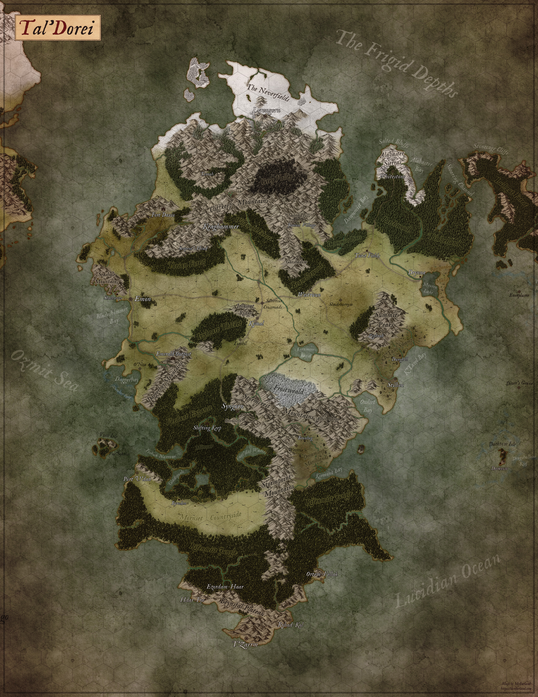 {.size-full .print-only}

(print-page)

{.size-cover .screen-only}
# Tal'Dorei
The continent of Tal'Dorei is located in the heart of [Exandria](exandria), nestled between the continents of [Issylra](Issylra) to the west and [Wildemount](wildemount) to the east. While not as large as [Issylra](Issylra) or as populous as [Wildemount](wildemount), [Tal'Dorei](taldorei) is growing quickly.  The slowest to recover following the Calamity, Tal'Dorei has made up for lost time and is growing in population, wealth and power.

##### Regions
The continent of Tal'Dorei is divided into the following eight regions:
- [Alabaster Sierras](alabaster-sierras)
- [Bladeshimmer Shoreline](bladeshimmer-shoreline)
- [Cliffkeep Mountains](cliffkeep-mountains)
- [Dividing Plains](dividing-plains)
- [Lucidian Coast](lucidian-coast)
- [Rifenmist Peninsula](rifenmist-peninsula)
- [Stormcrest Mountains](stormcrest-mountains)
- [Verdant Expanse](verdant-expanse)
{.square}

(print-page)

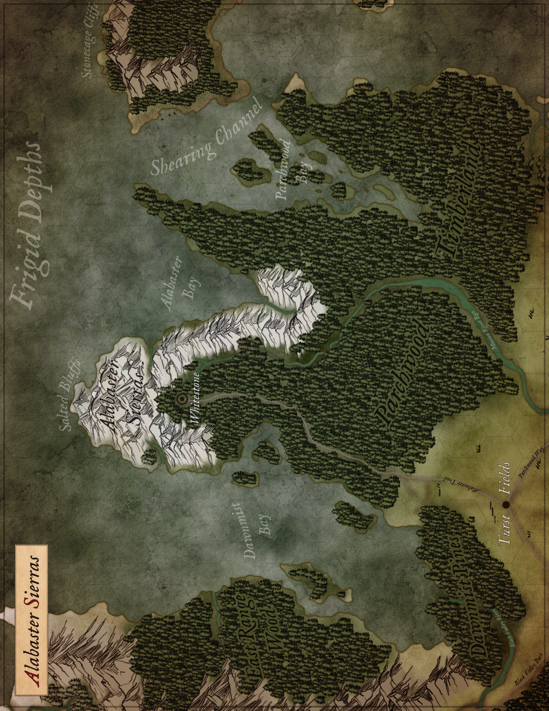{.size-full .print-only}

(print-page)

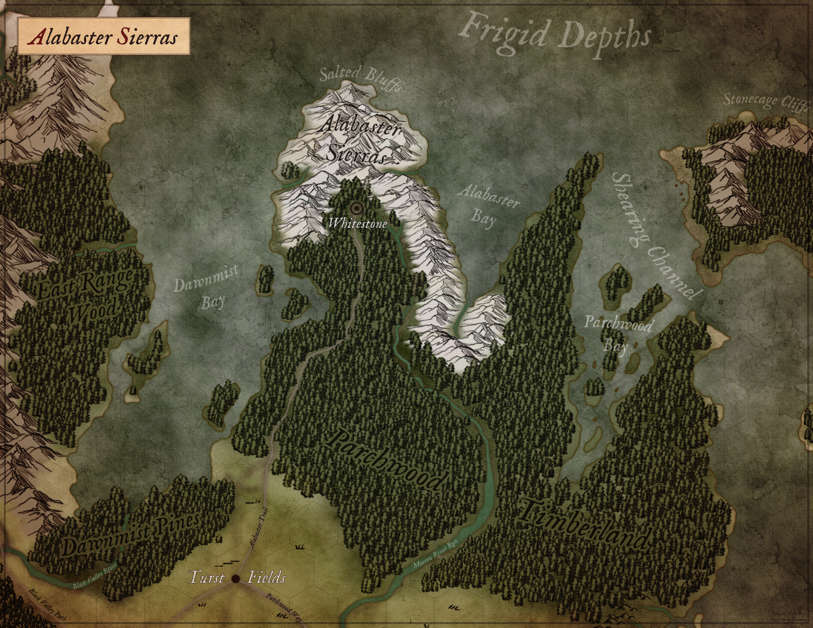{.size-cover .screen-only}
## Alabaster Sierras
[^Exandria^](geography) ^>^ [^Tal'Dorei^](taldorei)

^Area:^ **^137,181^ ^sq^ ^mi^** ^-^ ^Population:^ **^333,268^**

Located in the northeast corner of the continent, the Alabaster Sierras are named for the chalk-white [mountains](alabaster-sierra-range) that run the length of the Alabaster Peninsula. While named for the [Alabaster Sierra range](alabaster-sierra-range), it is the massive [Parchwood Timberland](parchwood-timberland) that truly dominates the region.

While the region is bordered to the south by the [Dividing Plains](dividing-plains) and the [Lucidian Coast](lucidian-coast), the region is largely surrounded by water. The [Alabaster Bay](alabaster-bay) and [Dawnmist Bay](dawnmist-bay) frame the main peninsula, while the [Shearing Channel](shearing-channel) and [Lucidian Ocean](lucidian-ocean) cut the region off from the continent of [Wildemount](wildemount) to the east.

##### Demographics
While the city of [Whitestone](whitestone) and surrounding villages are predominantly human, sizable numbers of giants, goblins, orcs, and centaurs call the more remote corners of the region home.

|||||||
|:-----------|:---:|:-----------|:---:|:-----------|:---:|
| Human      | 67% | Dwarf      | 6%  | -          |     |
| Halfling   |  7% | -          | -   | Other      | 19% |
{.gray}

##### Climate
The region has a **humid continental climate (Dfb)**. Winters are long and cold with snowfall common from late fall to early spring. Summers are warm, but short with a fair amount of rain.

| |~Spring~|~Summer~|~Fall~|~Winter~|
|:-----|:----:|:----:|:----:|:----:|
| High | 52°  | 76°  | 58°  | 34°  |
| Low  | 34°  | 56°  | 39°  | 16°  |
| Rain | 4.0" | 3.5" | 4.5" | 3.5" |
| Snow | 5.1" | 0.0" | 0.6" |14.8" | 
{.gray}

(print-column)

##### Factions
The dominant factions in the region are:
- **Chamber of Whitestone**. Governs the city of [Whitestone](whitestone) and the surrounding countryside.
- **House de Rolo**. The ruling family of [Whitestone](whitestone) and head of the Chamber of Whitestone.
- **Pale Guard**. The guard responsible for the city of [Whitestone](whitestone) & surrounding area.
- **Whitestone Riflemen**. Defenders of [Castle Whitestone](castle-whitestone) and the Chamber of Whitestone.
{.square}

##### Geography
The prominent geographical features in the region are:
- [Alabaster Bay](alabaster-bay)
- [Alabaster Sierras](alabaster-sierra-range)
- [Alabaster Trail](alabaster-trail)
- [Dawnmist Bay](dawnmist-bay)
- [Parchwood Bay](parchwood-bay)
- [Parchwood Timberland](parchwood-timberland)
- [Salted Bluffs](salted-bluffs)
- [Shearing Channel](shearing-channel)
- [Upper Mooren River Run](upper-mooren-river-run)
{.square}

##### Religion
For nearly two hundred years, **Pelor** and **Erathis** have been the dominant religions in the city of [Whitestone](whitestone) and surrounding area. After the exodus from [Emon](emon) and the sudden influx of refugees, followers of the other Prime Deities have become more commone. Chief among these is the **Raven Queen** who has a small shrine in the Greyfields of [Whitestone](whitestone). 

In the southern reaches of the [Parchwood](parchwood-timberland), followers of **Gruumsh** and **Yeenoghu** are common among the more aggressive orc and gnoll tribes of the eastern [Dividing Plains](dividing-plains), while some tribes have turned to worshipping the **Melora the Wild Mother**.

##### Settlements
The major settlements in the region are:
- [Whitestone](whitestone) (4,230)
{.gray}

(print-page)

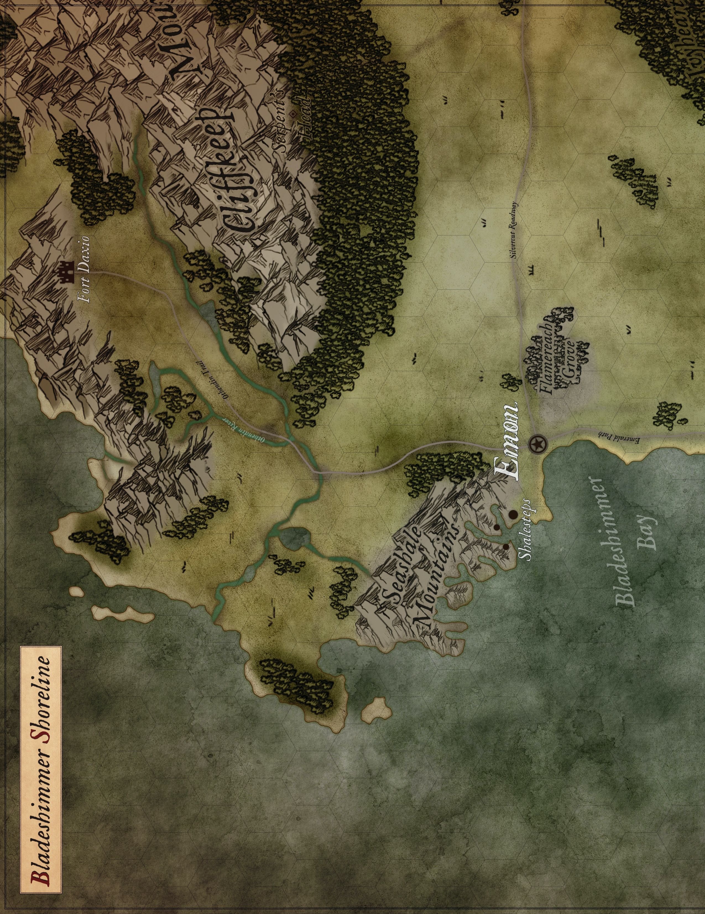{.size-full .print-only}

(print-page)

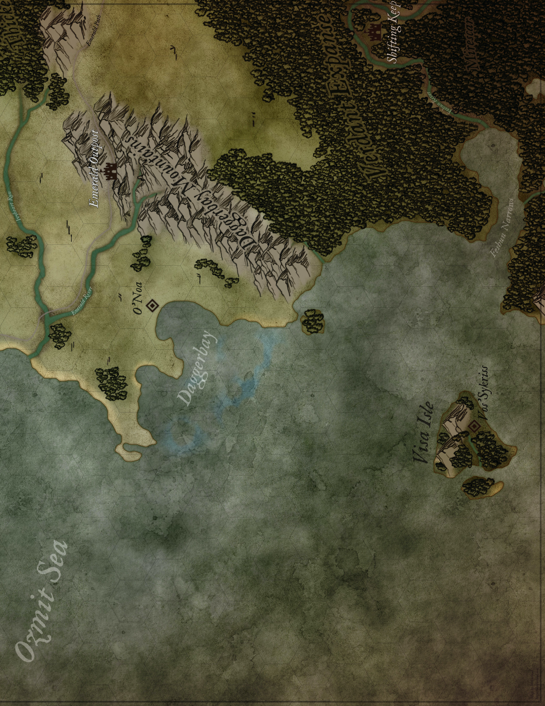{.size-full .print-only}

(print-page)

{.size-cover .screen-only}

## Bladeshimmer Shoreline
[^Exandria^](geography) ^>^ [^Tal'Dorei^](taldorei)

^Area:^ **^137,181^ ^sq^ ^mi^** ^-^ ^Population:^ **^333,268^**

The Bladeshimmer Shoreline is located on the central, western coast of [Tal'Dorei](taldorei) and stretches some one thousand miles from the [Seashale Mountains](seashale-mountains) in the north to the [Daggerbay Mountains](daggerbay-mountains) and [Visa Isles](visa-isle) in the south. With the [Ozmit Sea](ozmit-sea) to its west, the Bladeshimmer extends inland as far as the [Ironseat Ridge](ironseat-ridge) before giving way to the [Dividing Plains](dividing-plains) of central [Tal'Dorei](taldorei).

While the Bladeshimmer Shoreline is one of the smaller regions on the continent, it is by far the most powerful both politically and economically. Home to the city of [Emon](emon), the region's success depends almost entirely on the fortune of the city and the stewardship of the Council of Tal'Dorei.

##### Climate
The Bladeshimmer Shoreline has a **warm temperate oceanic (Cfb)** climate. It has cool, wet winters, and mild summers with a fair amount of precipitation. 

| |~Spring~|~Summer~|~Fall~|~Winter~|
|:-----|:----:|:----:|:----:|:----:|
| High | 58°  | 71°  | 59°  | 47°  |
| Low  | 43°  | 54°  | 47°  | 38°  |
| Rain | 2.3" | 0.9" | 3.3" | 4.9" |
| Snow | 0.0" | 0.0" | 0.0" | 0.2" | 
{.gray}

##### Demographics
Predominantly human for the first few centuries following the Calamity, the Bladeshimmer Shoreline and its crown-jewel, the city of [Emon](emon) have become increasingly more diverse. The economic growth of the region has drawn people from all over [Exandria](exandria) to the [City of Fellowship](emon) on the shores of the [Bladeshimmer Bay](bladeshimmer-bay). 

|||||||
|:-----------|:---:|:-----------|:---:|:-----------|:---:|
| Human      | 68% | Elf        |  6% | -          | -   |
| Dwarf      |  7% | Halfling   |  1% | Other      | 18% |
{.gray}

##### Factions
The dominant factions in the region are:
- **Arms of Emon**. The city watch and defense force for the city of [Emon](emon) and surrounding countryside.
- **Clasp, The**. A powerful crime syndicate that has extensive influence throughout the region.
- **Council of Tal'Dorei**. The ruling council for [Emon](emon) and the greater Republic of Tal'Dorei.
- **House of Tal'Dorei**. The former ruling family of Tal'Dorei and still a powerful noble family.
- **Verdant Guard**. The elvish guard and military of the [Emerald Outpost](emerald-outpost).
{.square}

##### Geography
The prominent geographical features in the region are:
- [Bladeshimmer Bay](bladeshimmer-bay)
- [Scar of the Cinder King](scar-of-the-cinder-king)
- [Crystalfen Caverns](crystalfen-caverns)
- [Daggerbay](daggerbay)
- [Daggerbay Mountains](daggerbay-mountains)
- [Emerald Path](emerald-path)
- [Emerald River](emerald-river)
- [Flamereach Grove](flamereach-grove) (was Shivergreen Grove)
- [Ivyheart Run](ivyheart-run)
- [Ivyheart Thicket](ivyheart-thicket)
- [Nightwash Tide](nightwash-tide)
- [Othendin Trail](othendin-trail)
- [Ruins of Salar](ruins-of-salar)
- [Ruins of Vos'Sykriss](ruins-of-vosykriss)
- [Seashale Mountains](seashale-mountains)
- [Slumber Reef](slumber-reef)
- [Snowember Fields](snowember-fields)
- [Visa Isle](visa-isle)
{.square}

##### Religion
People of all faiths can be found throughout the region, but **Erathis** and **Bahamut** are the most widely worshipped. Within the walls of [Emon](emon) temples and shrines can be found for all of the Prime Deities and even some of the Betrayer Gods. In the countryside, followers of **Pelor**, **Avandra**, and **Melora** are quite common.

##### Settlemetnts
The major settlements in the region are:
- [Emerald Outpost](emerald-outpost) (1,456)
- [Emon](emon) (287,550)
- [Ruins of O'Noa](ruins-of-onoa) (336)
- [Shalesteps](shalesteps) (456)

(print-page)

(print-page)

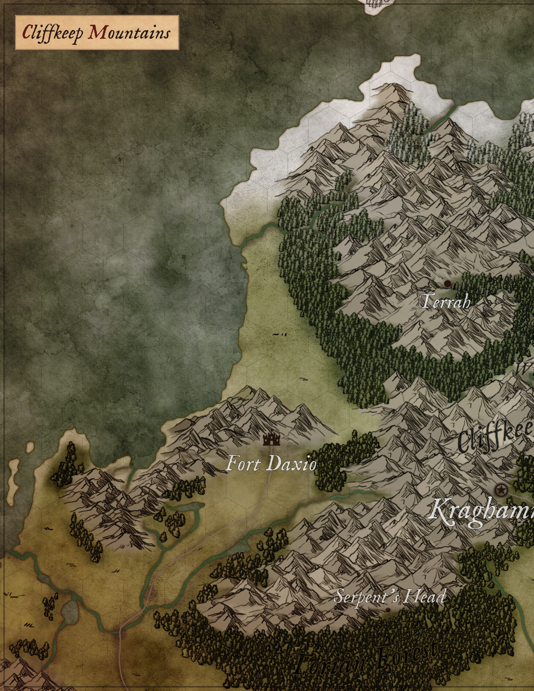{.size-full .print-only}

(print-page)

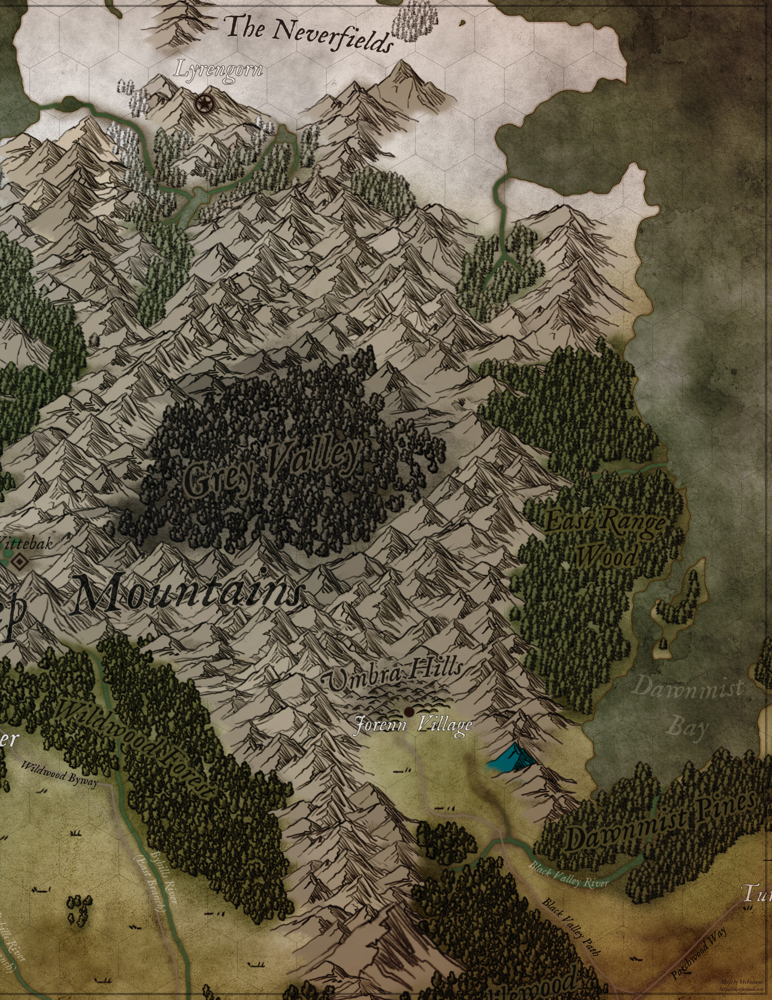{.size-full .print-only}

(print-page)

{.size-cover .screen-only}

## Cliffkeep Mountains
[^Exandria^](geography) ^>^ [^Tal'Dorei^](taldorei)

^Area:^ **^461,427^ ^sq^ ^mi^** ^-^ ^Population:^ **^59,247^**

The Cliffkeep Mountains is the largest region in all of [Tal'Dorei](taldorei) and occupies the northern third of the continent. Virtually all of which is dominated by various mountain ranges that make up the [mountain range](cliffkeep-mountain-range) of the same name. 

The region stretches from the [Ozmit Sea](ozmit-sea) on [Tal'Dorei's](taldorei) northwestern shores to the [Dawnmist Bay](dawnmist-bay) that separates it from the [Alabaster Sierras](alabaster-sierras) to the east. To the north lies the frozen waters of the [Frigid Depths](frigid-depths) while the temperate [Bladeshimmer Shoreline](bladeshimmer-shoreline) and [Dividing Plains](dividing-plains) of central [Tal'Dorei](taldorei) to the south.

##### Climate
The Cliffkeep Mountains is a large region with a ***humid continental climate (Dwb)*** with warm summers and cold, dry winters in the south, and a ***subarctic climate (Dfc)*** with long, cold winters and brief, warm summers in the north. The following numbers are from the more populous southern half.

###### Northern Cliffkeeps
| |~Spring~|~Summer~|~Fall~|~Winter~|
|:-----|:----:|:----:|:----:|:----:|
| High | 43°  | 70°  | 33°  |  5°  |
| Low  | 19°  | 49°  | 15°  | -14° |
| Rain | 0.4" | 1.8" | 0.9" | 0.5" |
| Snow | 3.0" | 0.0" | 8.7" |  10" | 
{.gray}

###### Southern Cliffkeeps
| |~Spring~|~Summer~|~Fall~|~Winter~|
|:-----|:----:|:----:|:----:|:----:|
| High | 56°  | 79°  | 58°  | 35°  |
| Low  | 30°  | 47°  | 31°  | 14°  |
| Rain | 1.9" | 1.8" | 1.2" | 0.5" |
| Snow | 4.3" | 0.0" | 3.6" | 8.7" | 
{.gray}

##### Demographics
An incredibly large region, the Cliffkeep Mountains are home to many different races and cultures. Dwarves and gnomes are most common near the dwarven stronghold of [Kraghammer](kraghammer), elves in the northern city of [Lyrengorn](lyrengorn), and humans at [Fort Daxio](fort-daxio) and [Jorenn Village](jorenn-village). Largely uncounted are millions of goliaths, goblinoids, orcs, kobolds, and giants that live in scattered settlements throughout the region.

|||||||
|:-----------|:---:|:-----------|:---:|:-----------|:---:|
| Dwarves    | 65% | Humans     |  9% | -          | -   |
| Elves      | 10% | Gnomes     |  8% | Other      |  8% |
{.gray}

##### Factions
The dominant factions in the region are:
- **Army of Tal'Dorei**. The military of the Republic of Tal'Dorei, stationed at [Fort Daxio](fort-daxio).
- **Ashari (Terrah)**. A druidic tribe that guard the elemental rifts to the elemental plane of Earth.
- **Carvers**. The police and military protectors of the dwarven stronghold of [Kraghammer](kraghammer).
- **Houses of Kraghammer**. The five noble houses of [Kraghammer](kraghammer) that rule the dwarven city.
- **Icewalkers**. A nomadic tribe of orcs that live in the nearly inhospitable [Neverfields](neverfields).
- **Shadewatch**. The informal and largely corrupt guard for the town of [Jorenn Village](jorenn-village).
- **Skyswimmers**. The wyvern-riders of [Lyrengorn](lyrengorn) are performers and quasi-defenders of the [Elvenpeaks](elvenpeaks).
{.square}

##### Geography
The prominent geographical features in the region are:
- [Black Valley](black-valley) (was Emerald Valley)
- [Black Valley Path](black-valley-path)
- [Cliffkeep Mountains](cliffkeep-mountain-range) (Mountain Range)
- [East Wood](east-wood)
- [Elvenpeaks](elvenpeaks)
- [Gatshadow](gatshadow)
- [Grey Valley](grey-valley)
- [Neverfields](neverfields)
- [Othendin Pass](othendin-pass)
- [Othendin Trail](othendin-trail)
- [Pools of Wittebak](pools-of-wittebak)
- [Ruins of Serpent's Head](serpents-head)
- [Ruins of Wittebak](ruins-of-wittebak)
- [Torian Forest](torian-forest)
- [Umbra Hills](umbra-hills) (was Emerald Highlands)
- [West Wood](west-wood)
- [Wildwood](wildwood)
- [Wildwood Byway](wildwood-byway)
{.square}

##### Settlements
The major settlements in the region are:
- [Emberhold](emberhold) (Unknown)
- [Fort Daxio](fort-daxio) ()
- [Jorenn Village](jorenn-village) ()
- [Kraghammer](kraghammer) ()
- [Terrah](terrah) ()
- [Yug'Voril](yugvoril) (Unknown)
{.square}

(print-page)

(print-page)

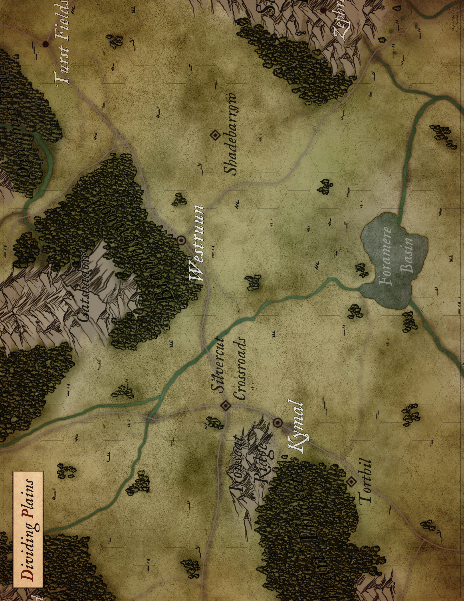{.size-full .print-only}

(print-page)

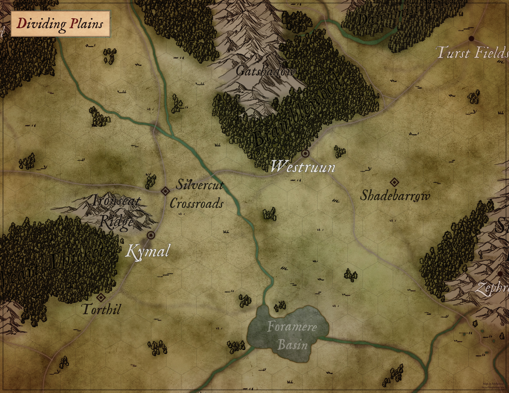{.size-cover .screen-only}

## Dividing Plains
[^Exandria^](geography) ^>^ [^Tal'Dorei^](taldorei)

^Area:^ **^261,891^ ^sq^ ^mi^** ^-^ ^Population:^ **^44,483^**

Located in the heart of [Tal'Dorei](taldorei), the Dividing Plains is a wide open grassland that stretches from the [Bladeshimmer Shoreline](bladeshimmer-shoreline) in the west to the [Lucidian Coast](lucidian-coast) in the east. The rolling pastoral hills and plains are a sharp contrast to the towering peaks of the [Cliffkeep Mountains](cliffkeep-mountains) to the north and the lush forest of the [Verdant Expanse](verdant-expanse) to the south.

In addition to being the bread basket of the continent, the Dividing Plains serves as the economic backbone of the three dominant civilizations on [Tal'Dorei](taldorei). The dwarven stronghold of [Kraghammer](kraghammer), elven kingdom of [Syngorn](syngorn) and the human Republic of Tal'Dorei depend on the region's network of roads for trade.

##### Climate
Located in the central, temperate region of [Tal'Dorei](taldorei), the Dividing Plains has a ***humid continental climate (Dfa)*** with hot summers and cold winters. Precipitation is consistent year-round and snowfall substantial in the winter months.
 
| |~Spring~|~Summer~|~Fall~|~Winter~|
|:-----|:----:|:----:|:----:|:----:|
| High | 67°  | 90°  | 69°  | 45°  |
| Low  | 41°  | 64°  | 43°  | 23°  |
| Rain | 2.1" | 3.0" | 1.4" | 0.7" |
| Snow | 2.0" | 0.0" | 0.6" | 4.3" | 
{.gray}

##### Demographics
Like the other regions in central [Tal'Dorei](taldorei), humans are an overwhelming majority in the major settlements in the region. Still, the Dividing Plains is surprisingly diverse out in the countryside. Small farmsteads and hamlets are scattered throughout the region and many of these small settlements are non-human. Likewise, tribes of centaurs, gnolls, goliaths, and orcs wander the plains, never staying in one place too long.

|||||||
|:-----------|:---:|:-----------|:---:|:-----------|:---:|
| Human      | 66% | Dwarf      |  3% | Gnoll      |  1% |
| Gnome      |  8% | Halfling   |  2% | Other      | 20% |
{.gray}

##### Factions
The dominant factions in the region are:
- **Clasp, The**. A powerful crime syndicate that has extensive influence throughout the region.
- **Dustpaw Gnolls**. A large tribe of gnolls that live among and protect the town of [Turst Fields](turst-fields).
- **Myriad, The**. A rival criminal syndicate to the Clasp from [Wildemount](wildemount).
- **Ravagers**. An tribe of orcs that are strict adherents of Gruumsh and terrorize the region.
- **Rivermaw Tribe**. A large, nomadic tribe of various peoples that reside in the [Torian Forest](torian-forest).
- **Shields of the Plains**. The military and police for the Republic's settlements in the plains.
{.square}

##### Geography
The prominent geographical features in the region are:
- [Blazing Foundry](blazing-foundry)
- [Bramblewood](bramblewood)
- [Byhills River](byhills-river)
- [Dawnmist Pines](dawnmist-pines)
- [Foramere Basin](foramere-basin)
- [Foramere Waterway](foramere-waterway)
- [Ironseat Ridge](ironseat-ridge)
- [Ivyheart Thicket](ivyheart-thicket)
- [Parchwood Way](parchwood-way)
- [Ruins of Torthil](ruins-of-torthil)
- [Shadebarrow](shadebarrow)
- [Silvercut Crossroads](silvercut-crossroads)
- [Silvercut Roadway](silvercut-roadway)
- [Throne of the Archeart](throne-of-the-archeart)
- [Torian Forest](torian-forest)
- [Tundrun River](tundrun-river)
- [Wildwood Byway](wildwood-byway)
{.square}

##### Settlements
The major settlements in the region are:
- [Kymal](kymal)
- [Turst Fields](turst-fields)
- [Westruun](westruun)
{.square}

(print-page)

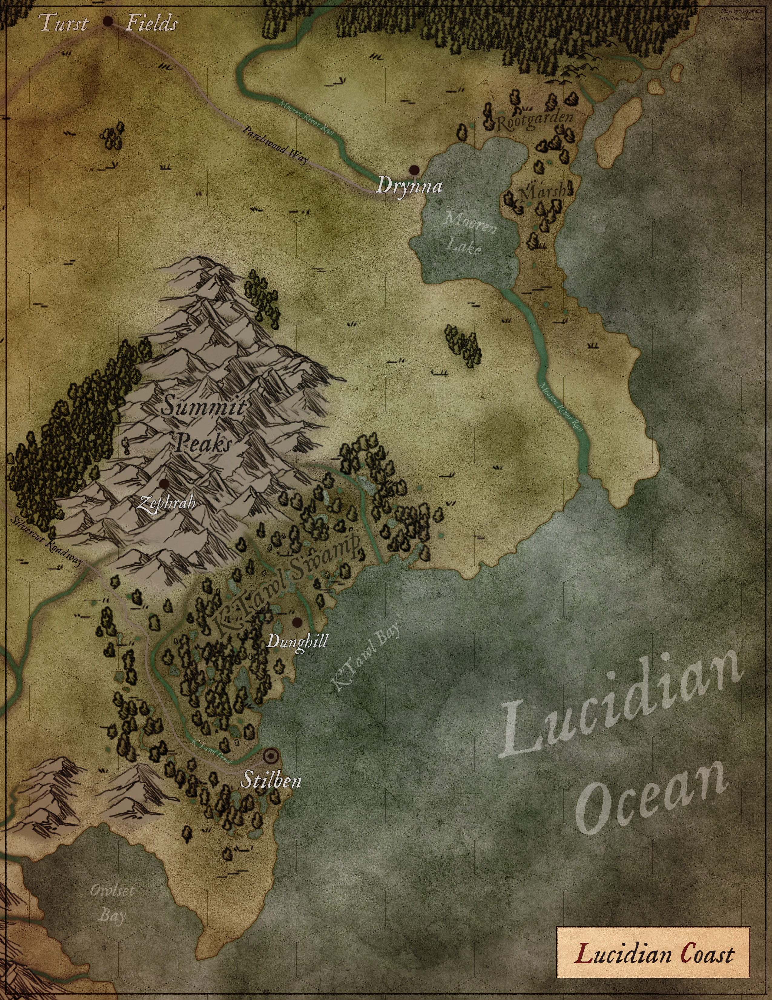{.size-full .print-only}

(print-page)

{.size-cover .screen-only}

## Lucidian Coast
[^Exandria^](geography) ^>^ [^Tal'Dorei^](taldorei)

^Area:^ **^174,594^ ^sq^ ^mi^** ^-^ ^Population:^ **^14,831^**

Located on the east coast of [Tal'Dorei](tal'dorei), the Lucidian Coast stretches from the base of the [Parchwood Timberland](parchwood-timberland) in the north to the [Owlset Bay](owlset-bay) at the eastern end of the [Stormcrest Mountains](stormcrest-mountains) in the south. Inland, the region extends as far as the western slope of the [Summit Peaks](summit-peaks) where it meets the central [Dividing Plains](dividing-plains).

Home to the port cities of [Stilben](stilben) and [Drynna](drynna), the [Lucidian Coast](lucidian-coast) is an important source of trade with the eastern continent of [Wildemount](wildemount) and the lucrative ports on the [Menagerie Coast](menagerie-coast).

##### Climate
The eastern coast of [Tal'Dorei](tal'dorei) has a **Humid subtropical climate (Cfa)** characterized by hot, humid summers and cold to mild winters. The region receives a great deal of rain year round.

| |~Spring~|~Summer~|~Fall~|~Winter~|
|:-----|:----:|:----:|:----:|:----:|
| High | 70°  | 86°  | 72°  | 53°  |
| Low  | 50°  | 70°  | 54°  | 36°  |
| Rain | 3.6" | 5.4" | 3.8" | 3.2" |
| Snow | 0.0" | 0.0" | 0.0" | 1.0" | 
{.gray}

##### Demographics
The Lucidian Coast is a much more diverse region than the streets of [Drynna](drynna) or [Stilben](stilben) might indicate. There are countless numbers of orcs, gnolls, and lizardfolk living in remote corners of the [K'Tawl](ktawl-swamp) and [Rootgarden Marsh](rootgarden-marsh).

|||||||
|:-----------|:---:|:-----------|:---:|:-----------|:---:|
| Human      | 68% | Elf        |  8% | Gnome      |  2% |
| Halfling   |  9% | Half Elf   |  6% | Other      |  7% |
{.gray}

(print-column)

##### Factions
The dominant factions in the region are:
- **Clasp, The**. The dominant criminal syndicate in [Tal'Dorei's](taldorei) power and influece in [Stilben](stilben) is waning.
- **Knifemouth Orcs**. A large, aggressive tribe of orcs in the [K'Tawl](ktawl-swamp) that occassionally raid caravans on the [Silvercut Roadway](silvercut-roadway).
- **Myriad, The**. A growing criminal syndicate out of [Wildemount](wildemount) with a firm foothold in the city of [Stilben](stilben).
- **Waterwatch**. The guard of [Stilben](stilben), the Waterwatch is heavily infiltrated by the Clasp and Myriad.
{.square}

##### Geography
The prominent geographical features in the region are:
- [Knifemouth River](knifemouth-river)
- [K'Tawl Bay](ktawl-bay)
- [K'Tawl Creek](ktawl-creek)
- [K'Tawl Swamp](ktawl-swamp)
- [Lower Mooren River Run](lower-mooren-river-run)
- [Mooren Lake](mooren-lake)
- [Owlset Bay](owlset-bay)
- [Rootgarden Marsh](rootgarden-marsh)
- [Summit Peaks](summit-peaks)
{.square}

##### Settlements
The major settlements in the region are:
- [Drynna](drynna)
- [Dunghill](dunghill)
- [Stilben](stilben)
- [Zephrah](zephrah)
{.square}

(print-page)

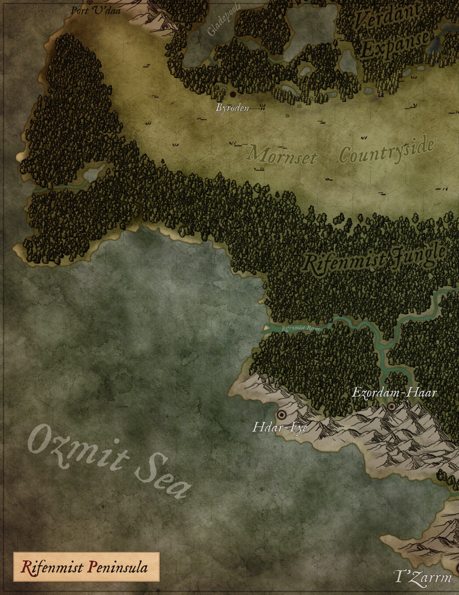{.size-full .print-only}

(print-page)

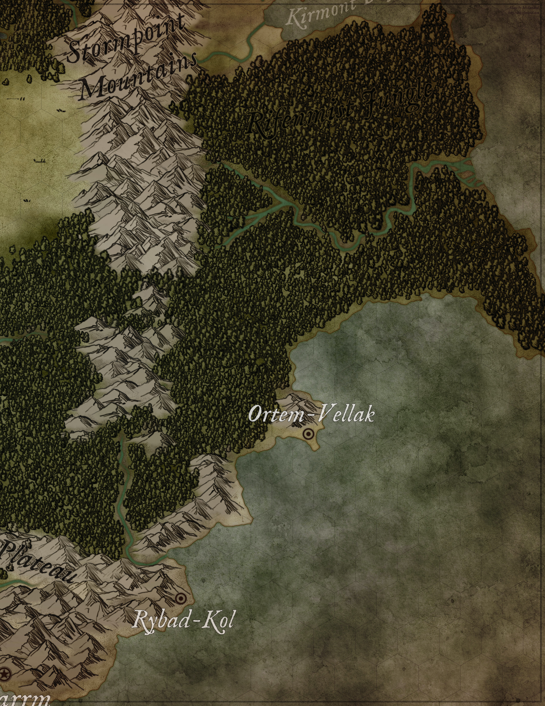{.size-full .print-only}

(print-page)

{.size-cover .screen-only}

## Rifenmist Peninsula
[^Exandria^](geography) ^>^ [^Tal'Dorei^](taldorei)

^Area:^ **^311,775^ ^sq^ ^mi^** ^-^ ^Population:^ **^168,343^**

Named for the massive [tropical rainforest](rifenmist-peninsula) that covers nearly two-thirds of the region, the Rifenmist Peninsula holds much more than its namesake. To the north of the jungle lies the rolling plains of the [Mornset Countryside](mornset-countryside), a wide-open buffer between the temperate [Verdant Expanse](verdant-expanse) and the tropical [Rifenmist Jungle](rifenmist-jungle).

To the south of the [jungle](rifenmist-jungle), the land rises steadily until it reaches the dry and rocky [Beynsfal Plateau](beynsfal-plateau). As if the harsh, unforgiving landsape were not enough, the plateau is home to the militaristic city-states of the hobgoblin empire, the Iron Authority.

##### Climate
The Rifenmist Peninsula is a complex region with multiple climates. The [jungle](rifenmist-jungle) is a **tropical rainforest (Af)** that is hot, humid and has an over-abundance of rain year-round. In the north, the [Mornset Countryside](mornset-countryside) is a **tropical savanna (As)** with moderately cooler temperatures and significantly less rainfall in the summer months. While to the south, the [Beynsfal Plateau](beynsfal-plateau) has a **hot-summer mediterranean (Csa)** climate that is hotter and drier than the rest of the region.

###### Beynsfal Plateau
| |~Spring~|~Summer~|~Fall~|~Winter~|
|:-----|:----:|:----:|:----:|:----:|
| High | 70°  | 88°  | 76°  | 62°  |
| Low  | 52°  | 68°  | 60°  | 46°  |
| Rain | 2.9" | 0.2" | 2.4" | 3.2" |
{.gray}

###### Rifenmist Jungle
| |~Spring~|~Summer~|~Fall~|~Winter~|
|:-----|:----:|:----:|:----:|:----:|
| High | 82°  | 85°  | 84°  | 83°  |
| Low  | 69°  | 70°  | 70°  | 68°  |
| Rain | 9.3" | 5.9" | 7.2" | 5.1" |
{.gray}

##### Demographics
Despite being one of the more populous regions in [Tal'Dorei](taldorei), the region is sparsely populated with the vast majority of its people packed into the southern city-states of the Iron Authority. These urban centers are overwhelmingly goblinoid, with hobgoblins holding nearly exclusive control over all other races through a rigid caste-based society, indentured servitude, and even slavery.

To the north, the peoples of the [Rifenmist Jungle](rifenmist-jungle) are more diverse and open. While the predominantly elven and tabaxi tribes of the [Rifenmist](rifenmist-jungle) are wary of outsiders, their wariness is based more on caution than ancestry. The same is true for the many small villages and hamlets that dot the [Mornset Countryside](mornset-countryside). 

|||||||
|:-----------|:---:|:-----------|:---:|:-----------|:---:|
| Hobgoblin  | 64% | Elf        |  5% | Human      |  1% |
| Goblinoid  | 18% | Half-Elf   |  1% | Other      | 11% |
{.gray}

##### Factions
The dominant factions in the region are:
- **Iron Authority**. A militaristic, goblin empire that controls the [Beynsfal Plateau](beynsfal-plateau) and horn of [Tal'Dorei](taldorei). 
- **Orroyen Tribes**. A loose confederation of semi-nomadic tribes that live deep in the wilds of the [Rifenmist Jungle](rifenmist-jungle).
{.square}

##### Geography
The prominent geographical features in the region are:
- [Beynsfal Plateau](beynsfal-plateau)
- [Horn of Tal'Dorei](horn-of-taldorei)
- [Mornset Countryside](mornset-countryside)
- [Orroyen River](orroyen-river)
- [Rifenmist Jungle](rifenmist-jungle)
- [Rifenmist River](rifenmist-river)
- [Stormpoint Mountains](stormpoint-mountains)
{.square}

##### Settlements
The major settlements in the region are:
- [Byroden](byroden)
- [Ezordam-Haar](ezordam-haar)
- [Hdar-Fye](hdar-fye)
- [Ortem-Vellak](ortem-vellak)
- [Port U'Daa](port-udaa)
- [Rybad-Kol](rybad-kol)
- [Tz'Arrm](tzarrm)
{.square}

(print-page)

(print-page)

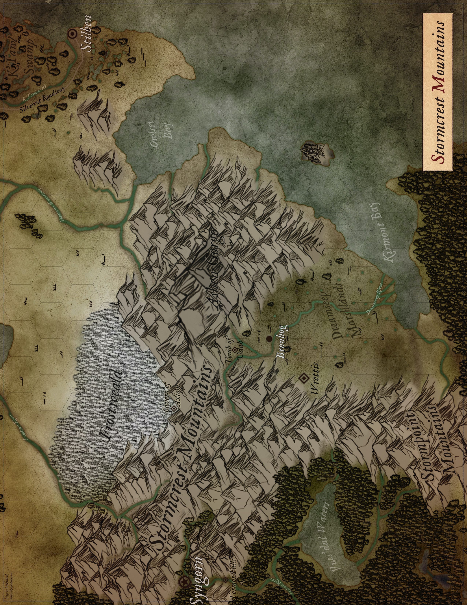{.size-full .print-only}

(print-page)

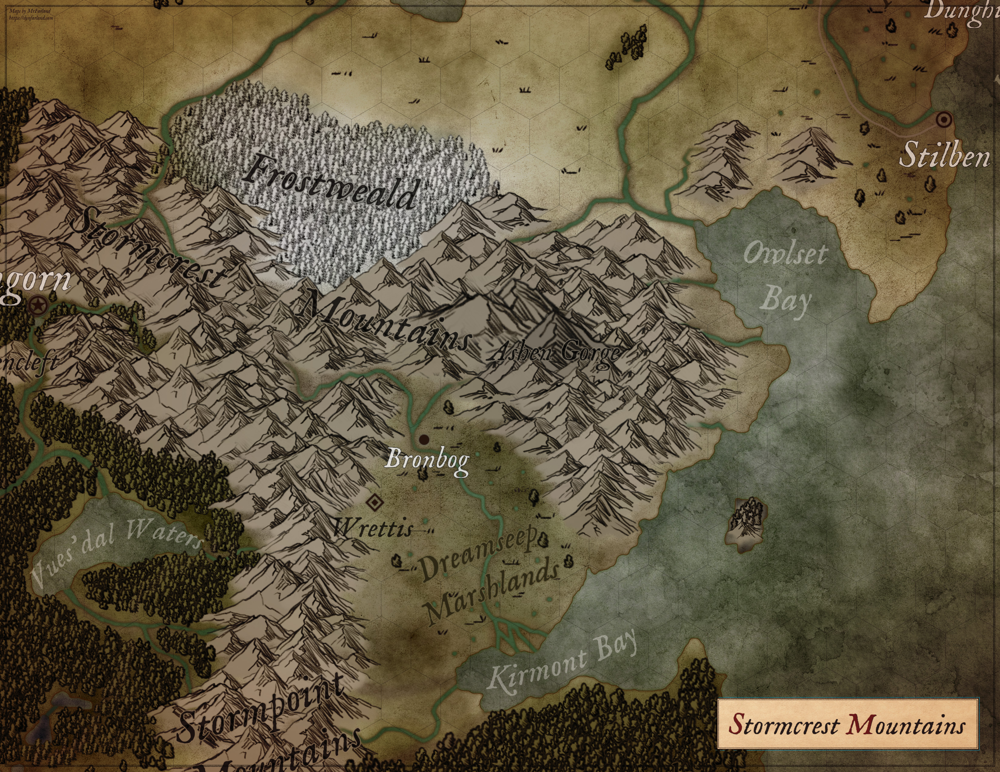{.size-cover .screen-only}

## Stormcrest Mountains
[^Exandria^](geography) ^>^ [^Tal'Dorei^](taldorei)

^Area:^ **^112,239^ ^sq^ ^mi^** ^-^ ^Population:^ **^3,848^**

The Stormcrest Mountains is the smallest region on the continent of [Tal'Dorei](taldorei) and also the least populated. Located on the eastern shore of the continent, the region is tucked into a small pocket of land between the [Lucidian Coast](lucidian-coast) to the north, the [Rifenmist Peninsula](rifenmist-peninsula) to the south, and the [Verdant Expanse](verdant-expanse) to the west.

Named for the storm-plagued [mountains](stormcrest-mountains) of the same name, the region is arguably better known for the massive [Dreamseep Marshlands](dreamseep-marshlands) that collect the runoff from the [Stormcrests](stormcrest-mountains) and slowly drain southward into the [Kirmont Bay](kirmont-bay).

##### Climate
While the climate in the mountains is considerably cooler than it is down in the [Kirmont Valley](kirmont-valley), the region is most widely known for the **humid subtropical (Cfa)** climate of the expansive [Dreamseep Marshlands](dreamseep-marshlands). The region is also well-known for the violent storms that rage across the peaks and drop a significant amount of water down the southern slope.

| |~Spring~|~Summer~|~Fall~|~Winter~|
|:-----|:----:|:----:|:----:|:----:|
| High | 77°  | 86°  | 78°  | 64°  |
| Low  | 64°  | 77°  | 66°  | 51°  |
| Rain | 4.0" | 5.8" | 3.9" | 4.3" |
{.gray}

##### Demographics
While the settlement of [Bronbog](bronbog) is the only settlement reflected in the numbers below, there are considerable numbers of indigenous tribes that call the region home. Kobolds, lizardfolk, orcs, goblins, giants, and grung all call the region home and likely outnumber the people of [Bronbog](bronbog) four to one.

|||||||
|:-----------|:---:|:-----------|:---:|:-----------|:---:|
| Human      | 64% | Halfling   |  9% | -          | -   |
| Half-Elf   | 18% | -          | -   | Other      |  9% |
{.gray}

##### Factions
The dominant factions in the region are:
- **Black Snow Tribe**. A tribe of Goliath, Half-Dragon revenants created from the blood of the ancient black dragon, Umbrasyl.
- **Scions of Flame**. 
- **Shivergut Tribe**. 
{.square}

##### Geography
The prominent geographical features in the region are:
- [Ashen Gorge](ashen-gorge)
- [Dreamseep Marshlands](dreamseep-marshlands)
- [Dreamseep River](dreamseep-river)
- [Frostweald](frostweald)
- [Kirmont Bay](kirmont-bay)
- [Kirmont Valley](kirmont-valley)
- [Stormcrest Mountains](stormcrest-mountain-range)
{.square}

##### Settlements
The major settlements in the region are:
- [Bronbog](bronbog)
{.square}

(print-page)

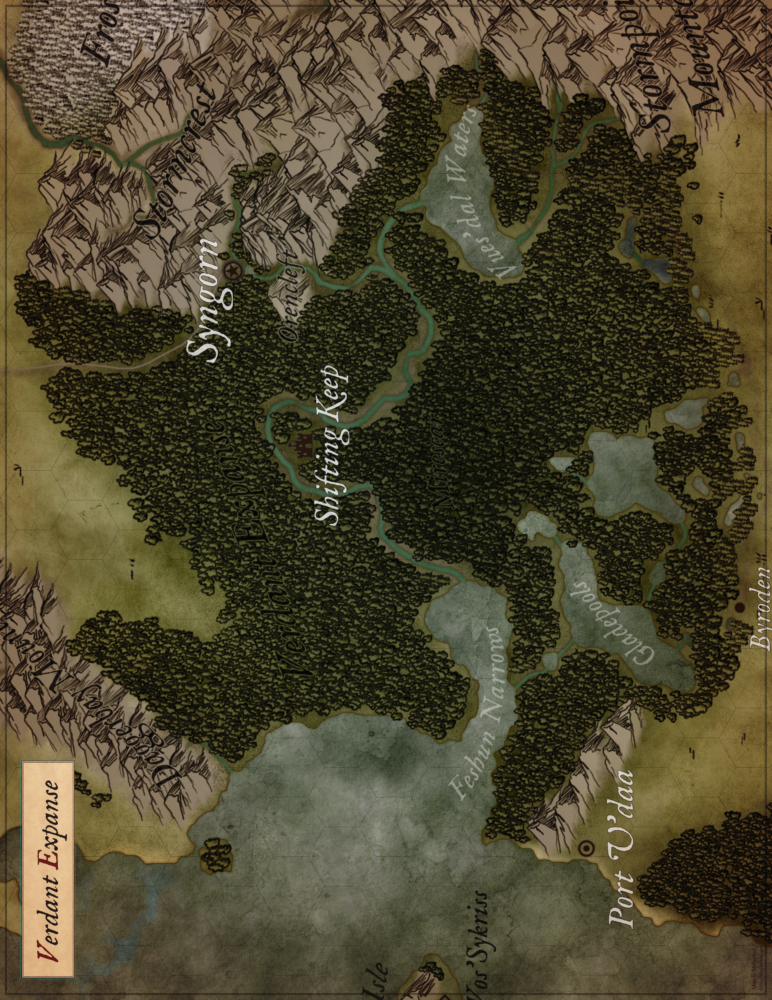{.size-full .print-only}

(print-page)

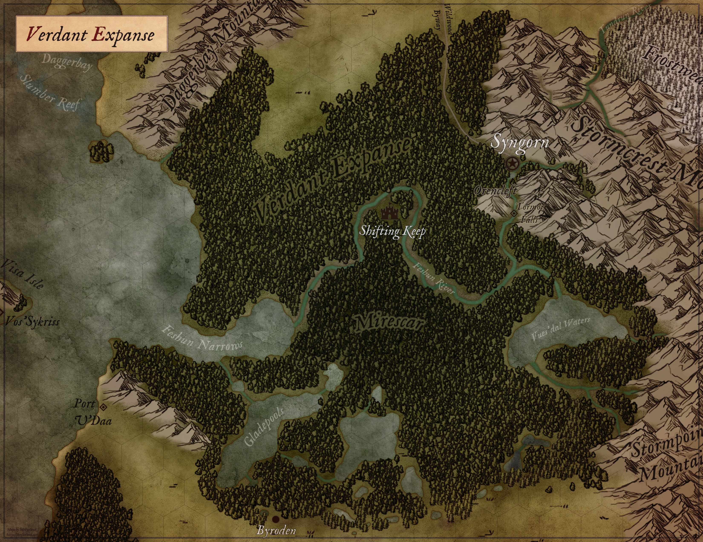{.size-cover .screen-only}

## Verdant Expanse
[^Exandria^](geography) ^>^ [^Tal'Dorei^](taldorei)

^Area:^ **^162,123^ ^sq^ ^mi^** ^-^ ^Population:^ **^40,410^**

Home to the elven kingdom of [Syngorn](syngorn), the Verdant Expanse is a large, temperate forest that stretches from the [Stormcrest](stormcrest-mountains) and [Stormpoint](stormpoint-mountains) mountains in the east and follows the [Feshun River](feshun-river) to the [Ozmit Sea](ozmit-sea) in the west. 

While the elves of [Syngorn](syngorn) have enjoyed centuries of peace with the human Republic of Tal'Dorei, the Verdant Guard watch their northern borders with the [Bladeshimmer Shoreline](bladeshimmer-shoreline) and [Dividing Plains](dividing-plains) as closely as their border with the lawless [Rifenmist Peninsula](rifenmist-peninsula) to the south.

##### Climate
The Verdant Expanse has a **Humid subtropical (Cfa)** climate with hot, humid summers and generally cool winters. The region receives a good deal of rain year round.

| |~Spring~|~Summer~|~Fall~|~Winter~|
|:-----|:----:|:----:|:----:|:----:|
| High | 70°  | 84°  | 71°  | 49°  |
| Low  | 48°  | 67°  | 50°  | 30°  |
| Rain | 4.5" | 3.6" | 3.6" | 3.9" |
| Snow | 0.3" | 0.0" | 0.0" | 2.0" | 
{.gray}

##### Demographics
Lorem ipsum dolor sit amet, consectetur adipiscing elit. Proin libero diam, tempor sed mauris ac, aliquet dapibus lectus. Donec vulputate sem nunc, eget sagittis est tempor eget. Aliquam eleifend consequat ultricies. Cras euismod porttitor neque, ut condimentum ante placerat nec.

|||||||
|:-----------|:---:|:-----------|:---:|:-----------|:---:|
| -          | -   | -          | -   | -          | -   |
| -          | -   | -          | -   | Other      | -   |
{.gray}

##### Factions
The dominant factions in the region are:
- **Faction**. 
- **Faction**. 
- **Faction**. 
- **Faction**. 
- **Faction**. 
{.square}

##### Geography
The prominent geographical features in the region are:
- Geography
{.square}

##### Settlements
The major settlements in the region are:
- Settlement
{.square}
