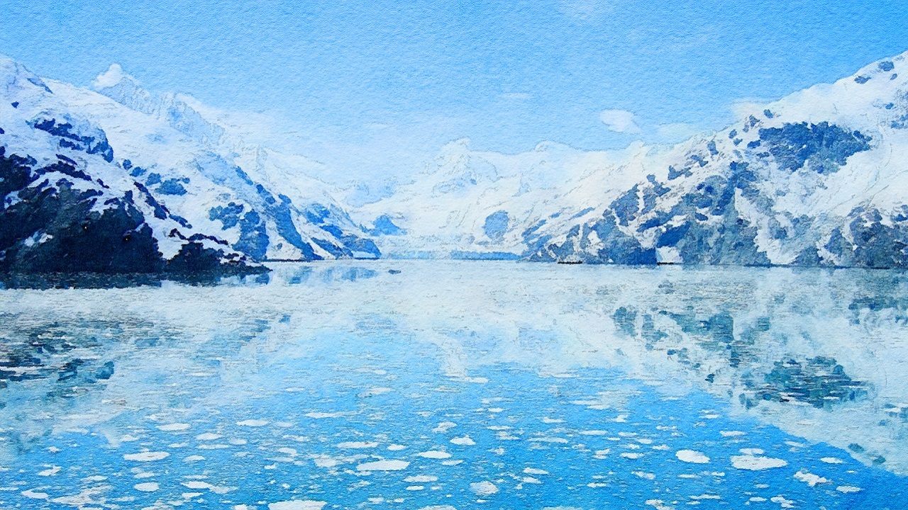
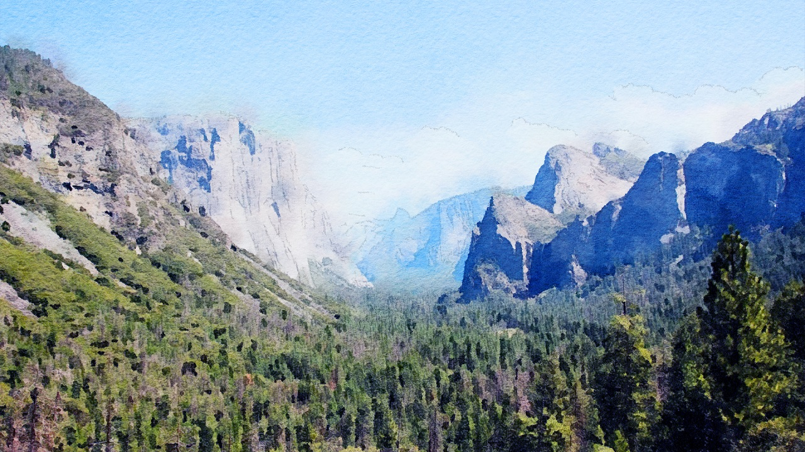
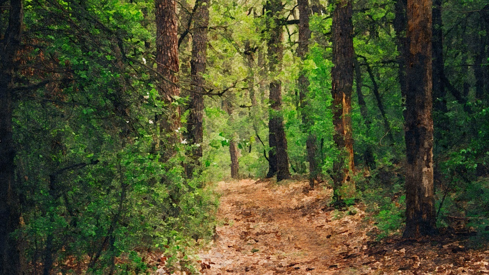
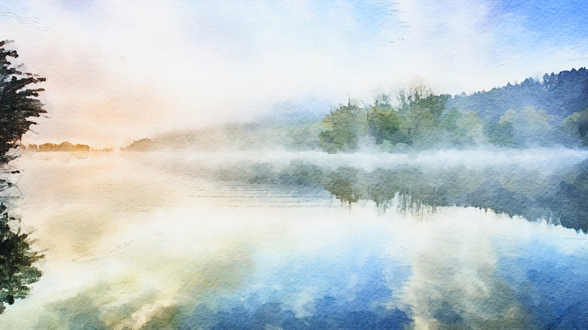
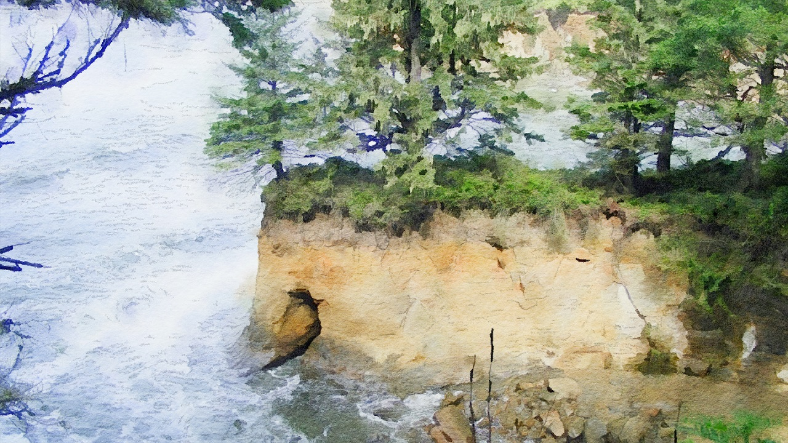
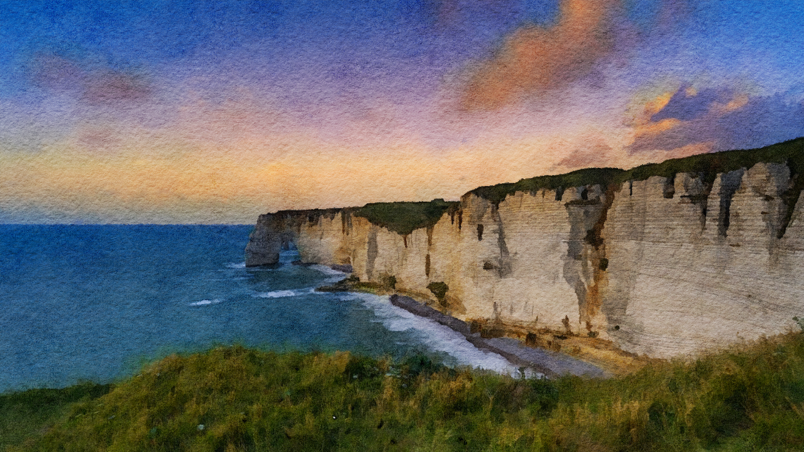
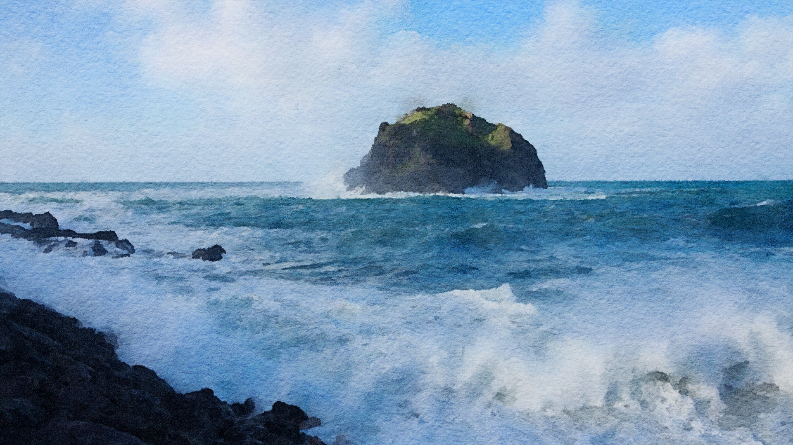
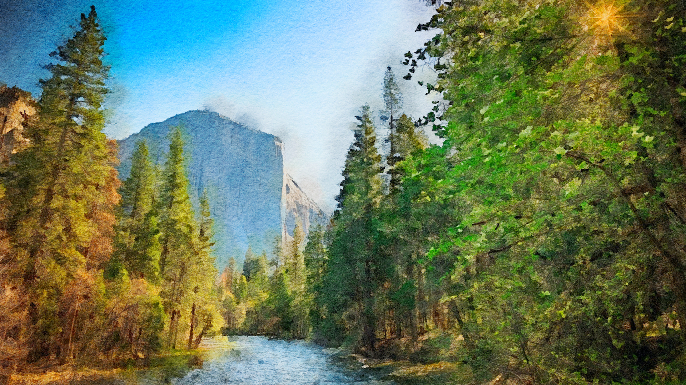
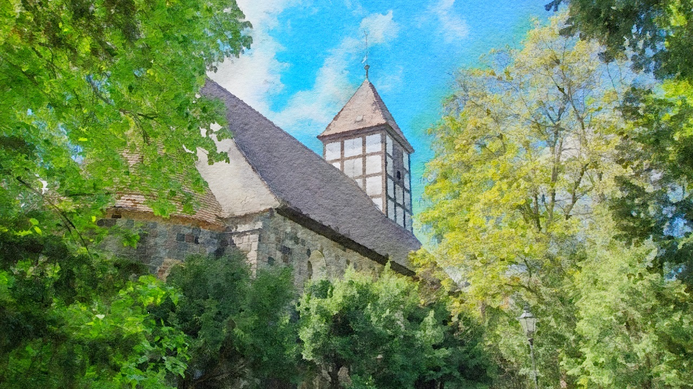

 {.size-full .print-only}

(print-page)

{.size-cover .screen-only}
# Tal'Dorei
The continent of Tal'Dorei is located in the heart of [Exandria](exandria), nestled between the continents of [Issylra](Issylra) to the west and [Wildemount](wildemount) to the east. While not as large as [Issylra](Issylra) or as populous as [Wildemount](wildemount), [Tal'Dorei](taldorei) is growing quickly.  The slowest to recover following the Calamity, Tal'Dorei has made up for lost time and is growing in population, wealth and power.

##### Regions
The continent of Tal'Dorei is divided into the following eight regions:
- [Alabaster Sierras](alabaster-sierras)
- [Bladeshimmer Shoreline](bladeshimmer-shoreline)
- [Cliffkeep Mountains](cliffkeep-mountains)
- [Dividing Plains](dividing-plains)
- [Lucidian Coast](lucidian-coast)
- [Rifenmist Peninsula](rifenmist-peninsula)
- [Stormcrest Mountains](stormcrest-mountains)
- [Verdant Expanse](verdant-expanse)
{.square}

(print-page)

{.size-full .print-only}

(print-page)

{.size-cover .screen-only}
## Alabaster Sierras
[^Exandria^](geography) ^>^ [^Tal'Dorei^](taldorei)

^Area:^ **^63,911^ ^sq^ ^mi^** ^-^ ^Population:^ **^5,288^**

Located in the northeast corner of the continent, the Alabaster Sierras are named for the chalk-white mountains that run the length of the Alabaster Peninsula. While named for the Alabaster Sierra range, it is the massive [Parchwood Timberland](parchwood-timberland) that truly dominates the region.

The region is bordered by the [Dividing Plains](dividing-plains) and [Lucidian Coast](lucidian-coast) to the south and by water to the east, north, and west. The Alabaster and [Dawnmist Bay](dawnmist-bay)s frame the peninsula and the [Shearing Channel](shearing-channel) separates the region from the continent of [Wildemount](wildemount) to the east.

##### Climate
The region has a **humid continental climate (Dfb)** with long, cold winters with plenty of snowfall. Summers are warm, but short with a fair amount of rain.

| |~Spring~|~Summer~|~Fall~|~Winter~|
|:-----|:----:|:----:|:----:|:----:|
| High | 52°  | 76°  | 58°  | 34°  |
| Low  | 34°  | 56°  | 39°  | 16°  |
| Rain | 4.0" | 3.5" | 4.5" | 3.5" |
| Snow | 5.1" | 0.0" | 0.6" |14.8" | 
{.gray}

##### Demographics
While the city of [Whitestone](whitestone) and surrounding villages are predominantly human, [gnolls](/monster/gnoll), [orcs](/monster/orc), [kobolds](/monster/kobold), [goblins](/monster/goblin) and [stone giants](/monster/stone-giant) are common throughout the region.

|||||||
|:-----------|:---:|:-----------|:---:|:-----------|:---:|
| Human      | 68% | Halfling   | 6%  | Kobold     |  3% |
| Dwarf      |  6% | Goblin     | 4%  | Other      |  9% |
{.gray}

(print-column)

##### Factions
The dominant factions in the region are:
- **[Chamber of Whitestone](castle-whitestone)**. Governs the city of [Whitestone](whitestone) and the surrounding countryside.
- **[Pale Guard](pale-guard-barracks)**. Guard the city of [Whitestone](whitestone), the surrounding area and northern [Alabaster Trail](alabaster-trail).
{.square}

##### Geography
The prominent geographical features in the region are:
- [Alabaster Bay](alabaster-bay)
- [Alabaster Sierras](alabaster-sierra-range)
- [Alabaster Trail](alabaster-trail)
- [Dawnmist Bay](dawnmist-bay)
- [Parchwood Bay](parchwood-bay)
- [Parchwood Timberland](parchwood-timberland)
- [Salted Bluffs](salted-bluffs)
- [Shearing Channel](shearing-channel)
- [Upper Mooren River Run](upper-mooren-river-run)
{.square}

##### Religion
The dominant religions in the region are:
- **Pelor**. Pelor is deeply ingrained in the culture of [Whitestone](whitestone) and is the dominant faith in the city.
- **Erathis**. While less popular than Pelor, the Law Bearer has a sizable following in the city.
- **Melora**. Melora's is popular in the wilds and is gaining influence among some orc & gnoll tribes.
{.square}

##### Settlements
The major settlements in the region are:
- [Whitestone](whitestone)
{.square}

(print-page)

### Alabaster Bay
[^Exandria^](geography) ^>^ [^Tal'Dorei^](taldorei) ^>^ [^Alabaster^ ^Sierras^](alabaster-sierras)

^Type:^ **^Underwater^** ^-^ ^Danger:^ **^Normal^** ^-^ ^Terrain:^ **^Normal^**

The [Alabaster Bay](alabaster-bay) is a large bay located on the east side of the [Alabaster Peninsula](alabaster-sierras) and west of the [Shearing Channel](shearing-channel). While not as rough as the open waters of the [Frigid Depths](frigid-depths), the [Alabaster Bay](alabaster-bay) offers little protection from the brutal storms that plague, [Exandria's](exandria) northern ocean.

##### Dangers
[Killer whales](/monster/killer-whale) and [sea lions](/monster/sea-lion) hunt seals along the western shore and [harpies](/monster/harpy) and [wyverns](/monster/wyvern) attack ships that get too close to the [Alabaster Sierras](alabaster-sierra-range).

##### Environment
During the winter months, **Extreme Cold** and **Frigid Water** can prove fatal for the unprepared.

##### Foraging
^Food:^ **^Abundant^** ^-^ ^Water:^ **^Rare^**

Fish and crabs are plentiful and with the proper tools easy to catch. Fresh water is scarce.

##### Travel

Travel is usually uneventful, but winter storms, heavy fog, and the occassional iceberg blow in from the [Frigid Depths](frigid-depths).

(print-column)

### Alabaster Sierra Range

[^Exandria^](geography) ^>^ [^Tal'Dorei^](taldorei) ^>^ [^Alabaster^ ^Sierras^](alabaster-sierras)

^Type:^ **^Mountain^** ^-^ ^Danger:^ **^High^** ^-^ ^Terrain:^ **^Difficult^**

Named for their chalk-white color, the Alabaster Sierra range stretches three hundred miles along the western shore of the [Alabaster Bay](alabaster-bay) and hook around the northern tip to form the towering cliffs of the [Salted Bluffs](salted-bluffs). 

##### Dangers
[Giants](/monster/stone-giant), [goblins](/monster/goblin), [kobolds](/monster/kobold), and [orcs](/monster/orc) give the people of [Whitestone](whitestone) a wide berth, but do not tolerate trespassers.

[Harpies](/monster/harpy) and [wyverns](/monster/wyvern) nest in the mountain peaks and travelers must keep an eye on the skies at all times.

##### Environment
During the winter months, **Extreme Cold**, **Frigid Water** and blinding snowstorms are a common occurence as are rock slides and avalanches.

##### Foraging
^Food:^ **^Limited^** ^-^ ^Water:^ **^Abundant^**

Food becomes harder to find the higher one gets, but cold, clear streams can be found throughout the mountains.

##### Travel
The Sierras are difficult to traverse and travelers are advised to bring climbing gear and an experienced guide.

(print-page)

### Alabaster Trail
[^Exandria^](geography) ^>^ [^Tal'Dorei^](taldorei) ^>^ [^Alabaster^ ^Sierras^](alabaster-sierras)

^Type:^ **^Forest^** ^-^ ^Danger:^ **^High^** ^-^ ^Terrain:^ **^Normal^**

The [Alabaster Trail](alabaster-trail) is a small road that connects the city of [Whitestone](whitestone) at the northern tip of the [Alabaster Peninsula](alabaster-sierras) to the rest of [Tal'Dorei](taldorei). It winds southward for a little more than 360 miles through the [Parchwood Timberland](parchwood-timberland) to the town of [Turst Fields](turst-fields) in the eastern [Dividing Plains](dividing-plains).

##### Dangers
[Bandits](/monster/bandit) and the more aggressive [orc](/monster/orc) and [gnoll](/monster/gnoll) tribes in the area are a constant threat on the southern end of the road, but even they avoid the stretch through [Parchwood](parchwood-timberland).

##### Environment
While the [forest](parchwood-timberland) provides some shelter from the elements, **extreme cold** and **heavy snow** are common in winter.

##### Foraging
^Food:^ **^Abundant^** ^-^ ^Water:^ **^Limited^**

For much of it's length, edible plants, berries, and game can be found without a lot of effort. Fresh water is more scarce, with most streams near the road slow-moving and murky.

##### Travel
Travel on the [Alabaster Trail](alabaster-trail) is very dangerous and travelers are encouraged to travel in caravans and never at night.
- [Whitestone](whitestone) to [Turst Fields](turst-fields) - (360 mi, 12d)
{.square}

(print-column)

### Dawnmist Bay
[^Exandria^](geography) ^>^ [^Tal'Dorei^](taldorei) ^>^ [^Alabaster^ ^Sierras^](alabaster-sierras)

^Type:^ **^Underwater^** ^-^ ^Danger:^ **^Normal^** ^-^ ^Terrain:^ **^Normal^**

Located on the western side of the [Alabaster Peninsula](alabaster-sierras), the [Dawnmist Bay](dawnmist-bay) is a large, sheltered bay that drives deep into the continent of [Tal'Dorei](taldorei) . While technically an extension of the [Frigid Depths](frigid-depths), the bay is warmer and calmer than the [Alabaster Bay](alabaster-bay) on the other side of the peninsula. 

##### Dangers
A breeding ground for whales from the [Frigid Depths](frigid-depths), the bay is also home to a [sea monster](/monster/plesiosaurus) nicknamed "Misty".

##### Environment
The bay is named for the thick fog that often creeps in from the [Cliffkeeps](cliffkeep-mountain-range) to the west, **heavily obscuring** the bay.

##### Foraging
^Food:^ **^Abundant^** ^-^ ^Water:^ **^Rare^**

The bay is home to a variety of fish and catching them is not difficult for anyone with the proper tools.

##### Travel
While the bay is often calm, the fog makes navigating difficult by hiding dangerous shoals and islands.

(print-page)

### Parchwood Bay
[^Exandria^](geography) ^>^ [^Tal'Dorei^](taldorei) ^>^ [^Alabaster^ ^Sierras^](alabaster-sierras)

^Type:^ **^Underwater^** ^-^ ^Danger:^ **^High^** ^-^ ^Terrain:^ **^Difficult^**

The [Parchwood Bay](parchwood-bay) is an island-choked bay on the west side of the [Shearing Channel](shearing-channel) that separates [Tal'Dorei](tal'dorei) and [Wildemount](wildemount). While the bay seems like a great place to ride out a storm, the bay is a maze of heavily [forested](parchwood-timberland) islands and shoals that make navigating difficult. 

##### Dangers
The [Parchwood Bay](parchwood-bay) is crawling with terrible creatures of the deep. Sailors have reported coming across [hags](/monster/sea-hag), [giant crabs](/monster/giant-crabs), ghost ships, and even a [kraken](/monster/kraken).

##### Environment
While the bay provides some shelter from the storms that plague the [Shearing Channel](shearing-channel), they rocky islands and shoals leave little room to manuever in a bad storm.

##### Foraging
^Food:^ **^Abundant^** ^-^ ^Water:^ **^Limited^**

The bay is home to a vibrant marine ecosystem and many islands are rich with edible plants and wild game. Some of the larger islands have a source of fresh water.

##### Travel
Navigating the bay is difficult. The tall, forested islands, rocky shoals, and perpetually overcast weather make it hard to find the way out, once the [channel](shearing-channel) has been lost.

(print-column)

### Parchwood Timberland
[^Exandria^](geography) ^>^ [^Tal'Dorei^](taldorei) ^>^ [^Alabaster^ ^Sierras^](alabaster-sierras)

^Type:^ **^Forest^** ^-^ ^Danger:^ **^Very^ ^High^** ^-^ ^Terrain:^ **^Difficult^**

The [Parchwood Timberland](parchwood-timberland) is a massive evergreen forest that dominates the entire northeastern corner of [Tal'Dorei](taldorei). The forest is an unholy combination of towering trees and a thick, almost impenetrable underbrush. 

##### Dangers
While the forest is home to countless woodland beasts, the Parchwood is best known for the dire beasts, undead, corrupted plants, and lycanthropes that dwell within.

##### Environment
Winters are hard in the [Parchwood Timberland](parchwood-timberland). **Extreme cold** and **heavy snow** are common in the winter months and well into spring.

##### Foraging
^Food:^ **^Abundant^** ^-^ ^Water:^ **^Abundant^**

Edible plants, wild game, and fresh water are readily available in the Parchwood, but so are poisonous plants, dangerous beasts, and contaminated water.

##### Travel
Travelers are warned to stick to the [Alabaster Trail](alabaster-trail) on their way to and from the city of [Whitestone](whitestone) and to never stray from the trail. Those that do are rarely seen again.

(print-page)

### Salted Bluffs
[^Exandria^](geography) ^>^ [^Tal'Dorei^](taldorei) ^>^ [^Alabaster^ ^Sierras^](alabaster-sierras)

^Type:^ **^Forest^** ^-^ ^Danger:^ **^Very^ ^High^** ^-^ ^Terrain:^ **^Difficult^**

The [Salted Bluffs](salted-bluffs) are white cliffs that wrap around the north end of the [Alabaster Peninsula](alabaster-peninsula). The Bluffs stretch from the [Alabaster Bay](alabaster-bay) in the east to the [Dawnmist](dawnmist-bay) in the west, the [Salted Bluffs](salted-bluffs) are a network of towering spires, hidden coves, and caves.

##### Dangers
The greatest danger in the [Salted Bluffs](salted-bluffs) come not from the water, but the sky. [Harpies](/monster/harpy), [wyverns](/monster/wyvern), and [griffons](/monster/griffon) all nest in the towering spires swoop down on unsuspecting prey.

##### Environment
The [Salted Bluffs](salted-bluffs) are blasted by surging tides and **strong winds** year-round and **extreme cold** and **frigid water** during the long, cold winters.

##### Foraging
^Food:^ **^Limited^** ^-^ ^Water:^ **^Rare^**

Food and water are hard to come by in the [Salted Bluffs](salted-bluffs). There are few edible plants in the area and harvesting fish is difficult in the powerful tide.

##### Travel
Travel of any kind is difficult near the [Salted Bluffs](salted-bluffs). The rough tide, uneven ground, and strong winds make it difficult to navigate the area by boat, foot, or in the air.

(print-column)

### Shearing Channel
[^Exandria^](geography) ^>^ [^Tal'Dorei^](taldorei) ^>^ [^Alabaster^ ^Sierras^](alabaster-sierras)

^Type:^ **^Forest^** ^-^ ^Danger:^ **^Very^ ^High^** ^-^ ^Terrain:^ **^Difficult^**

The [Shearing Channel](shearing-channel) is a narrow channel that seperates the continents of [Tal'Dorei](taldorei) and [Wildemount](wildemount). The channel is less than 60 miles wide at it's narrowest point and roughly 300 miles from the temperate [Lucidian Ocean](lucidian-ocean) to the icy [Frigid Depths](frigid-depths).

##### Dangers
While the Channel itself is dangerous enough on its own, sailors are always on the lookout for the many sea monsters they hear tales of in [Port Damali](port-damali) and [Stilben](stilben).

##### Environment
Powerful storms, surging tides, and strong winds are the greatest danger to any vessel attempting the narrow passage between [Tal'Dorei](taldorei) and [Wildemount](wildemount).

##### Foraging
^Food:^ **^Abundant^** ^-^ ^Water:^ **^Rare^**

While there are plenty of fish in the sea, catching them in the tumultuous waters of the [Shearing Channel](shearing-channel) requires some skill.

##### Travel
While the traversing the channel should take no more than three days, ships can spend a week fighting violent storms and shifting currents before emerging on the other side. 

(print-page)

### Upper Mooren River Run
[^Exandria^](geography) ^>^ [^Tal'Dorei^](taldorei) ^>^ [^Alabaster^ ^Sierras^](alabaster-sierras)

^Type:^ **^Forest^** ^-^ ^Danger:^ **^Very^ ^High^** ^-^ ^Terrain:^ **^Difficult^**

The [Upper Mooren River Run](upper-mooren-river-run) is a long, fast-moving river that stretches over 600 miles from the northern tip of the [Alabaster Peninsula](alabaster-sierras) to the city of [Drynna](drynna) on the west bank of [Mooren Lake](mooren-lake). 

##### Dangers
As an important source of fresh water, the Mooren River Run is also an important source of food for many of the beasts and monstrosities that call the forest home.

##### Environment
In the spring, snowmelt from the [Alabaster Sierras](alabaster-sierra-range) cause the river to swell and the already fast-moving river becomes a torrent.

In the winter, the **frigid water** rarely freezes over due to the strong current, but when it does, the ice is thin and dangerous to walk on.

##### Foraging
^Food:^ **^Abundant^** ^-^ ^Water:^ **^Abundant^**

The cold, crystal clear [Mooren River Run](upper-mooren-river-run) is an important source of fresh water for the entire region and is home to various species of freshwater fish.

##### Travel
While the river is navigable by canoe or kayak, the trip is dangerous with numerous rapids and falls. Few are willing to brave the river and forest to save a few days.
- [Whitestone](whitestone) to [Drynna](Drynna) - (540 mi, 18d)
{.square}

(print-column)

### Whitestone
[^Exandria^](geography) ^>^ [^Tal'Dorei^](taldorei) ^>^ [^Alabaster^ ^Sierras^](alabaster-sierras)

^Type:^ **^City^** ^-^ ^Population:^ **^4,230^** ^-^ ^Area:^ **^69^ ^Acres^**

The city of [Whitestone](whitestone) is an independent city-state located in northeast [Tal'Dorei](taldorei) at the northern tip of the [Alabaster Sierras](alabaster-sierra-range) and surrounded by the [Parchwood Timberland](parchwood-timberland).

##### Administration
Whitestone is governed by the **[Chamber of Whitestone](castle-whitestone)**, which is led by **[House de Rolo](castle-whitestone)** and local leaders in the community.

##### Demographics
While the city is mostly human, [Whitestone](whitestone) was founded by refugees and its people are welcoming and tolerant.

|||||||
|:---|:---:|:---|:---:|:---|:---:|
| Human    | 83% | Dwarf    |  6% | Gnome    |  1% | 
| Halfling |  7% | Tiefling |  1% | Other    |  2% |
{.gray}

##### Defenses
Whitestone is surrounded by a large, stone wall and heavy gates protect all roads into the city. The city is defended by:
- **[Pale Guard](pale-guard-barracks)** (42). The primary defenders and police force for the city and surrounding villages.
- **[Whitestone Rifleman](whitestone-riflemen-barracks)** (20). The firearm-equipped guard of the de Rolos and [Castle Whitestone](castle-whitestone)
- **[Grey Hunt](estate-of-the-mistress-of-the-grey-hunt)** (8). Rangers patrol the [Parchwood](parchwood-timberland) and protect the city from the creatures that dwell there.
{.square}

In addition to the traditional defenses, the city is protected by an [Illusory Barrier](illusory-barrier) that hides the city from above.

(print-page)

##### Economy
^Strength:^ **^Booming^** ^-^ ^Crime:^ **^Low^**

Whitestone's economy is strong and booming and fueled by the city's signature exports, [white stone](/item/white-stone) and [residuum](/item/residuum).

##### Districts

**Castle Ward**. Home to [Castle Whitestone](castle-whitestone), this ward is located on the north side of the city atop a large hill.
- [Castle Whitestone](castle-whitestone)
- [Whitestone Riflemen Barracks](whitestone-riflemen-barracks)
{.square}

**Common Ward**. The largest of city's wards, this working class neighborhood is located on the south side of the city.
- [Estate of the Mistress of the Grey Hunt](estate-of-the-mistress-of-the-grey-hunt)
- [Lady's Chamber](ladys-chamber)
{.square}

**Dawnfather Square**. The commercial heart of the city, the [Sun Tree](sun-tree) is surrounded by shops, taverns, and artisans.
- [Sun Tree](sun-tree)
- [Ziggurat of Whitestone](ziggurat-of-whitestone) (Underground)
{.square}

**Greyfields**. The cemetary and temple district of [Whitestone](whitestone) is located outside the city walls on the east side of the city.
- [Alter of the Raven](alter-of-the-raven)
- [Zenith](zenith)
{.square}

**Northern Ward**. An affluent neighborhood and home to the majority of the city's nobility and merchant class.
- [Pale Guard Barracks](pale-guard-barracks)
{.square}

**Surrounding Area**. While most live inside the city's walls, there are many farms, mines, and quarries outside as well.
- None
{.square}

(print-column)

#### Altar of the Raven
[^Exandria^](geography) ^>^ [^Tal'Dorei^](taldorei) ^>^ [^Alabaster^ ^Sierras^](alabaster-sierras) ^>^ [^Whitestone^](whitestone)

^Type:^ **^Shrine^** ^-^ ^Staff:^ **^0^** ^-^ ^Residents:^ **^0^** ^-^ ^Guests:^ [**^1d4-2^**](/roll/1d4-2)

The Altar of the Raven is a small shrine to the **Raven Queen** located behind the [Zenith](zenith) temple to **Pelor** in the Greyfields of [Whitestone](whitestone). About the size of a noble's mausoleum, the building is completely made of stone with intricate reliefs depicting motifs of the Raven Queen, her ascension and symbols associated with her stewardship of fate and death.

The shrine was constructed ~815 P.D. by Lord Percival Fredrickstein von Musel Klossowski de Rolo III for Vax'ildan Vessar, champion of the Raven Queen, and brother to his future wife, Lady Vex'ahlia (Vessar) de Rolo. 

##### Occupants
The Altar of the Raven has no full-time clergy.

Guests often make offerings and prayers to the Raven Queen to guide a dying loved one to the afterlife. 

##### Services
An individual that prays to the Raven Queen at the Altar of the Raven cannot become undead should they pass within the next 7 days.

(print-page)

#### Castle Whitestone
[^Exandria^](geography) ^>^ [^Tal'Dorei^](taldorei) ^>^ [^Alabaster^ ^Sierras^](alabaster-sierras) ^>^ [^Whitestone^](whitestone)

^Type:^ **^Administration^ ^&^ ^Residence^** ^-^ ^Staff:^ **^?^** ^-^ ^Residents:^ **^?^** ^-^ ^Guests:^ [**^1d8^**](/roll/1d8)

Castle Whitestone (or Whitestone Castle) is a large, fortified keep on a large hill overlooking the north side of the [city](whitestone). The road from the north gate winds its way up the hill to the walled courtyard protecting the keep's main entrance. 

The ground floor of the keep houses the meeting chambers for the **Chamber of Whitestone**, a dining hall, study, and various other chambers for hosting guests and administering to the business of the city. The large central keep is home to the de Rolo family and their honored guests. Attached to the castle, on the east side are the [barracks](whitestone-riflemen-barracks) for the **Whitestone Riflemen**, an elite, firearm-equipped force tasked with protecting **House de Rolo** and the **Chamber of Whitestone**.

Beneath the castle are the private crypts for the de Rolo family, the dungeons, and various store rooms. It is rumored that there is a secret passage that leads out of the castle to the east side of the hill.

##### Occupants
- Name (Race, G, A) - Position/Title
{.square}

##### Goods
Coming Soon

##### Services
Coming Soon

(print-column)

#### Estate of the Mistress of the Grey Hunt
[^Exandria^](geography) ^>^ [^Tal'Dorei^](taldorei) ^>^ [^Alabaster^ ^Sierras^](alabaster-sierras) ^>^ [^Whitestone^](whitestone)

^Type:^ **^Defense^** ^-^ ^Staff:^ **^?^** ^-^ ^Residents:^ **^?^** ^-^ ^Guests:^ [**^1d4-2^**](/roll/1d4-2)

This estate was briefly the personal residence of Vex'ahlia Vessar prior to her marriage to Percival de Rolo and their moving into [Castle Whitestone](castle-whitestone). The residence is now the headquarters of the **Grey Hunt**, a group of rangers tasked with patrolling the surrounding [Parchwood](parchwood-timberland) and protecting the people of [Whitestone](whitestone) from the monsters that roam within.

##### Occupants
- Name (Race, G, A) - Position/Title
{.square}

##### Goods
Coming Soon

##### Services
Coming Soon

(print-page)

#### Illusory Barrier
[^Exandria^](geography) ^>^ [^Tal'Dorei^](taldorei) ^>^ [^Alabaster^ ^Sierras^](alabaster-sierras) ^>^ [^Whitestone^](whitestone)

^Type:^ **^Defense^** ^-^ ^Staff:^ **^0^** ^-^ ^Residents:^ **^0^** ^-^ ^Guests:^ **^0^**

The Illusory Barrier is collection of five obelisks around the city of [Whitestone](whitestone) designed to shield the city from above. When all five obelisks are powered by arcane energy, at the same time, they create a dome-like illusion causing the city to appear as unspoiled wilderness from above.

**Powering the Barrier**. An arcane spellcaster must expend 1 spell slot for 2 hours of illusion in each obelisk. Multiple casters are recommended due to the geographic dispersion and toll it takes on the casters. For every spell level sacrificed within a 24 hour period, the caster suffers 1 point of exhaustion.

##### Occupants
These locations do not have permanent staff or residents and are only used in times of need.

(print-column)

#### Lady's Chamber
[^Exandria^](geography) ^>^ [^Tal'Dorei^](taldorei) ^>^ [^Alabaster^ ^Sierras^](alabaster-sierras) ^>^ [^Whitestone^](whitestone)

^Type:^ **^Temple^** ^-^ ^Staff:^ **^3-4^** ^-^ ^Residents:^ **^1^** ^-^ ^Guests:^ [**^1d6-2^**](/roll/1d6-2)

The [Lady's Chambers](ladys-chambers), or the House of the Lawbearer, is the temple to Erathis in the city of [Whitestone](whitestone). Located on the west side of the Common Ward near the west gate, the [Lady's Chambers](ladys-chambers) is a small temple with a large, open-air courtyard and ampitheater.

The head of the temple is called the "Keeper" and they often serve as a member of the **[Chamber of Whitestone](castle-whitestone)**.

##### Occupants
The Lady's Chamber is staffed full-time by the [Keeper (Priest)](/monster/priest) and 2 to 3 [Acolytes](/monster/acolyte). During weekly services, the temple's ampitheater is usually full.

##### Services
Standard spellcasting services are available to members of the temple and followers of Erathis. All others must pay a fee for services or perform noble works for the Keeper.

(print-page)

#### Pale Guard Barracks
[^Exandria^](geography) ^>^ [^Tal'Dorei^](taldorei) ^>^ [^Alabaster^ ^Sierras^](alabaster-sierras) ^>^ [^Whitestone^](whitestone)

^Type:^ **^Barracks^** ^-^ ^Staff:^ **^40-45^** ^-^ ^Residents:^ **[^2d8^](/roll/2d8)** ^-^ ^Guests:^ [**^1d4-2^**](/roll/1d4-2)

Located in the northeast corner of the Northern Ward of [Whitestone](whitestone), the [Pale Guard](pale-guard-barracks) Barracks is the administrtive and training center for the guard force that protects the city of [Whitestone](whitestone). While called a barracks, the majority of the force reside in their own homes with a small, rotating detatchment stationed at the barracks in the event of an emergency. The barracks also contains the administrative offices, a small jail, armory, and training facilities. 

##### Occupants
The Captain of the [Pale Guard](pale-guard-barracks), or their deputy, as well as some administrative personnel can be found at the barracks at all hours. There is a small holding facility for drunks and disturbers of the peace, but serious criminals are held in the [Castle](castle-whitestone) dungeons.
{.square}

(print-column)

#### Sun Tree
[^Exandria^](geography) ^>^ [^Tal'Dorei^](taldorei) ^>^ [^Alabaster^ ^Sierras^](alabaster-sierras) ^>^ [^Whitestone^](whitestone)

The Sun Tree is a massive oak tree located in the heart of Dawnfather Square in the city of [Whitestone](whitestone). It is a couple of stories tall and its leaves are vibrant orange, red, and yellow year-round. The tree is a major landmark in the city and an integral part of the city's identity and soul. 

The Sun Tree was planted by **Pelor the Dawn Father** to mark the spot where **Tharizdun the Chained Oblivion** nearly killed **Ioun the Knowing Mistress**. The tree stands directly above a lost [temple](ziggurat-of-whitestone) to **Ioun**.

(print-page)

#### Whitestone Riflemen Barracks
[^Exandria^](geography) ^>^ [^Tal'Dorei^](taldorei) ^>^ [^Alabaster^ ^Sierras^](alabaster-sierras) ^>^ [^Whitestone^](whitestone)

^Type:^ **^Barracks^** ^-^ ^Staff:^ **^16-24^** ^-^ ^Residents:^ **[^2d6^](/roll/2d6)** ^-^ ^Guests:^ ^Rarely^

Located on the east side of the [Castle Whitestone](castle-whitestone) complex are the barracks for the **[Whitestone Riflemen](whitestone-riflemen-barracks)**, an elite, firearm-equipped guard tasked with the defense of the castle, the de Rolo family and the **[Chamber of Whitestone](castle-whitestone)**. The barracks is home to half of the Riflemen's number at any one time and all of the supplies and support staff they need to withstand a short siege.

##### Occupants
The Riflemen rotate in and out of the barracks constantly and the only occupants are typically sleeping or in the process of going on or coming off shift.
{.square}

(print-column)

#### Zenith
[^Exandria^](geography) ^>^ [^Tal'Dorei^](taldorei) ^>^ [^Alabaster^ ^Sierras^](alabaster-sierras) ^>^ [^Whitestone^](whitestone)

^Type:^ **^Temple^** ^-^ ^Staff:^ **^3-4^** ^-^ ^Residents:^ **^0^** ^-^ ^Guests:^ [**^1d10^**](/roll/1d6-2)

The Zenith is a temple to **Pelor the Dawn Father** in the Greyfields ward of [Whitestone](whitestone). The temple is made of stone and stained glass windows depict classic imagery of **Pelor**. A large wooden wreath of fire is carved into the heavy wooden doors at the front of the temple.

Inside wooden pews line either side of the main aisle and three 10' wide stained glass windows line each side. A large stone altar stands on a small raised platform in the back. Doors lead to two small rooms on either side of the temple. 

##### Occupants
The Zenith is staffed full-time by a [Priest](/monster/priest) and 2 to 3 [Acolytes](/monster/acolyte). As the dominant faith in the city, the temple has frequent visitors and is packed during weekly services.

##### Services
Standard spellcasting services are available to members of the temple and followers of Pelor. All others must pay a fee for services or perform noble works for the temple.

(print-page)

#### Ziggurat of Whitestone
[^Exandria^](geography) ^>^ [^Tal'Dorei^](taldorei) ^>^ [^Alabaster^ ^Sierras^](alabaster-sierras) ^>^ [^Whitestone^](whitestone)

The Ziggurat of Whitestone is an ancient temple to **Ioun the Knowing Mistress** that was coated in [residuum](/item/residuum) and corrupted by the Briarwoods to aid in the acension of **Vecna the Whispered One** to godhood. 

The Ziggurat was once a great temple to **Ioun the Knowing Mistress**, but exactly when it was constructed is unknown. During the Calamity, the temple was the location of a terrible battle between **Tharizdun the Chained Oblivion** and **Ioun** in which she was very nearly fatally wounded. After the battle, the temple sank into the ground and was forgotten, by all but **Pelor the Dawn Father**. He planted the [Sun Tree](sun-tree) directly above the ziggurat to mark its location and honor her valor.

(print-page)

(print-page)

{.size-full .print-only}

(print-page)

{.size-full .print-only}

(print-page)

{.size-cover .screen-only}

## Bladeshimmer Shoreline
[^Exandria^](geography) ^>^ [^Tal'Dorei^](taldorei)

^Area:^ **^98,204^ ^sq^ ^mi^** ^-^ ^Population:^ **^433,593^**

The Bladeshimmer Shoreline is located on the central, western coast of [Tal'Dorei](taldorei) and stretches some one thousand miles from the Seashale Mountains in the north to the Daggerbay Mountains and Visa Isle in the south. With the [Ozmit Sea](ozmit-sea) to its west, the Bladeshimmer extends inland as far as the Ironseat Ridge before giving way to the [Dividing Plains](dividing-plains) of central [Tal'Dorei](taldorei).

While the Bladeshimmer Shoreline is one of the smaller regions on the continent, it is by far the most powerful both politically and economically. Home to the city of Emon, the region's success depends almost entirely on the fortune of the city and the stewardship of the Council of Tal'Dorei.

##### Climate
The Bladeshimmer Shoreline has a **warm temperate oceanic (Cfb)** climate. It has cool, wet winters, and mild summers with a fair amount of precipitation. 

| |~Spring~|~Summer~|~Fall~|~Winter~|
|:-----|:----:|:----:|:----:|:----:|
| High | 58°  | 71°  | 59°  | 47°  |
| Low  | 43°  | 54°  | 47°  | 38°  |
| Rain | 2.3" | 0.9" | 3.3" | 4.9" |
| Snow | 0.0" | 0.0" | 0.0" | 0.2" | 
{.gray}

##### Demographics
First settled by humans following the Calamity, the Bladeshimmer Shoreline is still predominantly human, but has grown more diverse over the last few centuries. Immigration, fueled by political and economic stability has drawn people from all over [Exandria](exandria) to the region and its crown-jewel, City of Fellowship, Emon.

|||||||
|:-----------|:---:|:-----------|:---:|:-----------|:---:|
| Human      | 60% | Halfling   |  6% | Half=Elf   |  5% |
| Dwarf      |  6% | Elf        |  5% | Other      | 18% |
{.gray}

(print-column)

##### Factions
The dominant factions in this region are:
- **Clasp, The**. A powerful crime syndicate that has extensive influence throughout the region.
- **Council of Tal'Dorei**. The ruling council for Emon and the greater Republic of Tal'Dorei.
- **House of Tal'Dorei**. The former ruling family of Tal'Dorei and still a powerful noble family.
{.square}

##### Geography
The prominent geographical features in the region are:
- Bladeshimmer Bay
- Scar of the Cinder King
- Crystalfen Caverns
- Daggerbay
- Daggerbay Mountains
- Emerald Path
- Emerald River
- Flamereach Grove (was Shivergreen Grove)
- Ivyheart Run
- Ivyheart Thicket
- Nightwash Tide
- Othendin Trail
- Ruins of Salar
- Ruins of Vos'Sykriss
- Seashale Mountains
- Slumber Reef
- Snowember Fields
- Visa Isle
{.square}

##### Religion
The dominant religions in the region are:
- **Erathis** & **Bahamut**. The dominant religions in the city of Emon with large, influential congregations.
- **Pelor** & **Avandra**. Worshipped mostly in the rural countryside among the farmers of the region.
{.square}

##### Settlemetnts
The major settlements in the region are:
- Emerald Outpost
- Emon
- Ruins of O'Noa
- Shalesteps
{.square}

(print-page)

(print-page)

{.size-full .print-only}

(print-page)

{.size-full .print-only}

(print-page)

{.size-cover .screen-only}

## Cliffkeep Mountains
[^Exandria^](geography) ^>^ [^Tal'Dorei^](taldorei)

^Area:^ **^255,643^ ^sq^ ^mi^** ^-^ ^Population:^ **^152,359^**

The Cliffkeep Mountains is the largest region in all of [Tal'Dorei](taldorei) and occupies the northern third of the continent. Virtually all of which is dominated by various mountain ranges that make up the [mountain range](cliffkeep-mountain-range) of the same name. 

The region stretches from the [Ozmit Sea](ozmit-sea) on [Tal'Dorei's](taldorei) northwestern shores to the [Dawnmist Bay](dawnmist-bay) that separates it from the [Alabaster Sierras](alabaster-sierra-range) to the east. To the north lies the frozen waters of the [Frigid Depths](frigid-depths) while the temperate [Bladeshimmer Shoreline](bladeshimmer-shoreline) and [Dividing Plains](dividing-plains) of central [Tal'Dorei](taldorei) to the south.

##### Climate
The Cliffkeep Mountains is a large region with a ***humid continental climate (Dwb)*** with warm summers and cold, dry winters in the south, and a ***subarctic climate (Dfc)*** with long, cold winters and brief, warm summers in the north. The following numbers are from the more populous southern half.

| |~Spring~|~Summer~|~Fall~|~Winter~|
|:-----|:----:|:----:|:----:|:----:|
| High | 56°  | 79°  | 58°  | 35°  |
| Low  | 30°  | 47°  | 31°  | 14°  |
| Rain | 1.9" | 1.8" | 1.2" | 0.5" |
| Snow | 4.3" | 0.0" | 3.6" | 8.7" | 
{.gray}

*^Climate^ ^for^ ^the^ ^southern^ ^Cliffkeeps^ ^near^ ^Kraghammer^.*

##### Demographics
An large region, the Cliffkeeps are home to many different races and cultures. While dwarves, gnomes, and humans are the most common in the major population centers, large numbers of goblins, orcs, kobolds, and giants can be found throughout the region.

|||||||
|:-----------|:---:|:-----------|:---:|:-----------|:---:|
| Dwarf      | 40% | Human      |  9% | Kobold     |  5% |
| Goblin     |  9% | Gnomes     |  6% | Other      | 23% |
{.gray}

##### Factions
The dominant factions in the region are:
- **Army of Tal'Dorei**. The military of the Republic of Tal'Dorei, stationed at Fort Daxio.
- **Carvers**. The police and military protectors of the dwarven stronghold of Kraghammer.
- **Houses of Kraghammer**. The five noble houses of Kraghammer that rule the dwarven city.
{.square}

##### Geography
The prominent geographical features in the region are:
- Black Valley (was Emerald Valley)
- Black Valley Path
- Cliffkeep Mountains (Mountain Range)
- Elvenpeaks
- Gatshadow
- Grey Valley
- Neverfields
- Othendin Pass
- Othendin Trail
- Pools of Wittebak
- Ruins of Serpent's Head
- Ruins of Wittebak
- Torian Forest
- Umbra Hills
- Wildwood
- Wildwood Byway
{.square}

##### Religion
The dominant religions in the region are:
- **Moradin**. The dominant religion in the southern Cliffkeeps in and around Kraghammer.
- **Sehanine**. The Moon Weaver is the patron deity of the elves and drow of Lyrengorn.
- **Gruumsh**. While Melora is gaining influence among some orcs, the Ruiner still holds sway over most. 
{.square}

##### Settlements
The major settlements in the region are:
- Emberhold
- Fort Daxio
- Jorenn Village
- Kraghammer
- Terrah
- Yug'Voril
{.square}

(print-page)

(print-page)

{.size-full .print-only}

(print-page)

{.size-cover .screen-only}

## Dividing Plains
[^Exandria^](geography) ^>^ [^Tal'Dorei^](taldorei)

^Area:^ **^158,218^ ^sq^ ^mi^** ^-^ ^Population:^ **^114,201^**

Located in the heart of [Tal'Dorei](taldorei), the Dividing Plains is a wide open grassland that stretches from the [Bladeshimmer Shoreline](bladeshimmer-shoreline) in the west to the [Lucidian Coast](lucidian-coast) in the east. The rolling pastoral hills and plains are a sharp contrast to the towering peaks of the [Cliffkeep Mountains](cliffkeep-mountains) to the north and the lush forest of the [Verdant Expanse](verdant-expanse) to the south.

In addition to being the bread basket of the continent, the Dividing Plains serves as the economic backbone of the three dominant civilizations on [Tal'Dorei](taldorei). The dwarven stronghold of Kraghammer, elven kingdom of Syngorn and the human Republic of Tal'Dorei depend on the region's network of roads for trade.

##### Climate
Located in the central, temperate region of [Tal'Dorei](taldorei), the Dividing Plains has a ***humid continental climate (Dfa)*** with hot summers and cold winters. Precipitation is consistent year-round and snowfall substantial in the winter months.
 
| |~Spring~|~Summer~|~Fall~|~Winter~|
|:-----|:----:|:----:|:----:|:----:|
| High | 67°  | 90°  | 69°  | 45°  |
| Low  | 41°  | 64°  | 43°  | 23°  |
| Rain | 2.1" | 3.0" | 1.4" | 0.7" |
| Snow | 2.0" | 0.0" | 0.6" | 4.3" | 
{.gray}

##### Demographics
While the major settlements of the Dividing Plains are overwhelmingly human, the countryside is more diverse with sizable dwarf, elf, and halflings populations among the many farming communities that dot the landscape. The plains are also home to large, nomadic tribes of orcs, gnolls, goliaths, and centaurs. 

|||||||
|:-----------|:---:|:-----------|:---:|:-----------|:---:|
| Human      | 49% | Dwarf      |  8% | Elf        |  4% |
| Halfling   | 14% | Gnome      |  5% | Other      | 21% |
{.gray}

##### Factions
The dominant factions in the region are:
- **Clasp, The**. A powerful crime syndicate that has extensive influence throughout the region.
- **Myriad, The**. A rival to the Clasp, the Myriad has made significant inroads in the region.
- **Ravagers**. An tribe of orcs that are strict adherents of Gruumsh and terrorize the region.
- **Shields of the Plains**. The military and police for the Republic's settlements in the plains.
{.square}

##### Geography
The prominent geographical features in the region are:
- Blazing Foundry
- Bramblewood
- Byhills River
- Dawnmist Pines
- Foramere Basin
- Foramere Waterway
- Ironseat Ridge
- Ivyheart Thicket
- Parchwood Way
- Ruins of Torthil
- Shadebarrow
- Silvercut Crossroads
- Silvercut Roadway
- Throne of the Archeart
- Torian Forest
- Tundrun River
- Wildwood Byway
{.square}

##### Religion
The region is theologically diverse, but most people are very private in their worship. All of the Prime Deities are equally represented throughout the region, but .

##### Settlements
The major settlements in the region are:
- Kymal
- Turst Fields
- Westruun
{.square}

(print-page)

{.size-full .print-only}

(print-page)

{.size-cover .screen-only}

## Lucidian Coast
[^Exandria^](geography) ^>^ [^Tal'Dorei^](taldorei)

^Area:^ **^85,734^ ^sq^ ^mi^** ^-^ ^Population:^ **^16,383^**

Located on the east coast of [Tal'Dorei](tal'dorei), the Lucidian Coast stretches from the base of the [Parchwood Timberland](parchwood-timberland) in the north to the Owlset Bay at the eastern end of the [Stormcrest Mountains](stormcrest-mountains) in the south. Inland, the region extends as far as the western slope of the Summit Peaks where it meets the central [Dividing Plains](dividing-plains).

Home to the port cities of Stilben and Drynna, the [Lucidian Coast](lucidian-coast) is an important source of trade with the eastern continent of [Wildemount](wildemount) and the lucrative ports on the [Menagerie Coast](menagerie-coast).

##### Climate
The eastern coast of [Tal'Dorei](tal'dorei) has a **Humid subtropical climate (Cfa)** characterized by hot, humid summers and cold to mild winters. The region receives a great deal of rain year round.

| |~Spring~|~Summer~|~Fall~|~Winter~|
|:-----|:----:|:----:|:----:|:----:|
| High | 70°  | 86°  | 72°  | 53°  |
| Low  | 50°  | 70°  | 54°  | 36°  |
| Rain | 3.6" | 5.4" | 3.8" | 3.2" |
| Snow | 0.0" | 0.0" | 0.0" | 1.0" | 
{.gray}

##### Demographics
The Lucidian Coast is a much more diverse region than the streets of Drynna or Stilben might indicate. Orcs, gnolls, lizardfolk, and tortles are scattered throughout the K'Tawl Swamp and Rootgarden Marsh.

|||||||
|:-----------|:---:|:-----------|:---:|:-----------|:---:|
| Human      | 56% | Elf        |  6% | Orc        |  3% |
| Halfling   |  7% | Half Elf   |  5% | Other      | 23% |
{.gray}

(print-column)

##### Factions
The dominant factions in the region are:
- **Clasp, The**. The dominant criminal syndicate in [Tal'Dorei's](taldorei) power and influece in Stilben is waning.
- **Knifemouth Orcs**. A large, aggressive tribe in the K'Tawl Swamp that raid caravans on the Silvercut Roadway.
- **Myriad, The**. A criminal syndicate out of [Wildemount](wildemount) with a foothold in the city of Stilben.
- **Waterwatch**. The guard of Stilben, the Waterwatch is heavily infiltrated by the Clasp and Myriad.
{.square}

##### Geography
The prominent geographical features in the region are:
- K'Tawl Bay
- K'Tawl Creek
- K'Tawl Swamp
- Lower Mooren River Run
- Mooren Lake
- Owlset Bay
- Rootgarden Marsh
- Summit Peaks
{.square}

##### Religion
The dominant religions in the region are:
- **Avandra** & **Kord**. Popular among the sailors that operate out of the Port of Stilben and Drynna.
- **Melora**. A number of gnoll & orc tribes have broken from Gruumsh & Yeenoghu for the the Wild Mother.
{.square}

##### Settlements
The major settlements in the region are:
- Drynna
- Dunghill
- Stilben
- Zephrah
{.square}

(print-page)

{.size-full .print-only}

(print-page)

{.size-full .print-only}

(print-page)

{.size-cover .screen-only}

## Rifenmist Peninsula
[^Exandria^](geography) ^>^ [^Tal'Dorei^](taldorei)

^Area:^ **^136,395^ ^sq^ ^mi^** ^-^ ^Population:^ **^235,290^**

Named for the massive tropical rainforest that covers nearly two-thirds of the region, the Rifenmist Peninsula holds much more than its namesake. To the north of the jungle lies the rolling plains of the Mornset Countryside, a wide-open buffer between the temperate [Verdant Expanse](verdant-expanse) and the tropical Rifenmist Jungle.

To the south of the jungle, the land rises steadily until it reaches the dry and rocky Beynsfal Plateau. As if the harsh, unforgiving landsape were not enough, the plateau is home to the militaristic city-states of the hobgoblin empire, the Iron Authority.

##### Climate
The Rifenmist Peninsula is a complex region with multiple climates. The jungle is a **tropical rainforest (Af)** that is hot, humid and has an over-abundance of rain year-round. In the north, the Mornset Countryside is a **tropical savanna (As)** with moderately cooler temperatures and significantly less rainfall in the summer months. While to the south, the Beynsfal Plateau has a **hot-summer mediterranean (Csa)** climate that is hotter and drier than the rest of the region.

| |~Spring~|~Summer~|~Fall~|~Winter~|
|:-----|:----:|:----:|:----:|:----:|
| High | 70°  | 88°  | 76°  | 62°  |
| Low  | 52°  | 68°  | 60°  | 46°  |
| Rain | 2.9" | 0.2" | 2.4" | 3.2" |
{.gray}

*^Climate^ ^for^ ^the^ ^Beyndfal^ ^Plateau^ ^near^ ^Tz'Arrm^.*

##### Demographics
While the Rifenmist Peninsula is heavily populated, the majority of the people in the region live in the city-states of the Iron Authority on the Beynsfal Plateau. The city-states are predominantly goblinoid, with hobgoblins exercising almost total control over all other peoples. The rest of the region is much more open and diverse, but the various tribes and communities of the Rifenmist Jungle and Mornset Countryside are wary of outsiders.

|||||||
|:-----------|:---:|:-----------|:---:|:-----------|:---:|
| Hobgoblin  | 48% | Goblin     |  8% | Tabaxi     |  4% |
| Human      | 12% | Half-Elf   |  6% | Other      | 22% |
{.gray}

##### Factions
The dominant factions in the region are:
- **Iron Authority**. A militaristic, goblin empire that controls the Beynsfal Plateau. 
- **Orroyen Tribes**. A loose confederation of tribes that live deep in the wilds of the Rifenmist Jungle.
{.square}

##### Geography
The prominent geographical features in the region are:
- Beynsfal Plateau
- Mornset Countryside
- Orroyen River
- Rifenmist Jungle
- Rifenmist River
- Stormpoint Mountains
{.square}

##### Religion
The dominant religions in the region are:
- **Bane**. The official religion of the militaristic and oppressive Iron Authority on the Beynsfal Plateau.
- **Melora**. Popular among the Orroyen and tabaxi tribes of the Rifenmist Jungle.

##### Settlements
The major settlements in the region are:
- Byroden
- Ezordam-Haar
- Hdar-Fye
- Ortem-Vellak
- Port U'Daa
- Rybad-Kol
- Tz'Arrm
{.square}

(print-page)

(print-page)

{.size-full .print-only}

(print-page)

{.size-cover .screen-only}

## Stormcrest Mountains
[^Exandria^](geography) ^>^ [^Tal'Dorei^](taldorei)

^Area:^ **^70,146^ ^sq^ ^mi^** ^-^ ^Population:^ **^8,890^**

The Stormcrest Mountains is the smallest region on the continent of [Tal'Dorei](taldorei) and also the least populated. Located on the eastern shore of the continent, the region is tucked into a small pocket of land between the [Lucidian Coast](lucidian-coast) to the north, the [Rifenmist Peninsula](rifenmist-peninsula) to the south, and the [Verdant Expanse](verdant-expanse) to the west.

Named for the storm-plagued mountains of the same name, the region is arguably better known for the massive Dreamseep Marshlands that collect the runoff from the Stormcrests and slowly drain southward into the Kirmont Bay.

##### Climate
While the climate in the mountains is considerably cooler than it is down in the Kirmont Valley, the region is most widely known for the **humid subtropical (Cfa)** climate of the expansive Dreamseep Marshlands. The region is also well-known for the violent storms that rage across the peaks and drop a significant amount of water down the southern slope.

| |~Spring~|~Summer~|~Fall~|~Winter~|
|:-----|:----:|:----:|:----:|:----:|
| High | 77°  | 86°  | 78°  | 64°  |
| Low  | 64°  | 77°  | 66°  | 51°  |
| Rain | 4.0" | 5.8" | 3.9" | 4.3" |
{.gray}

##### Demographics
Above ground, the region is largely rural and very sparsely populated. The village of Bronbog is predominantly human, but the wilds of the Dreamseep and mountains are home to a number of kobold, lizardfolk, and orc tribes. Beneath the surface, the city of Ruhn-Shak is almost exclusively drow.

|||||||
|:-----------|:---:|:-----------|:---:|:-----------|:---:|
| Drow       | 69% | Gnome      |  4% | Orc        |  2% |
| Human      | 10% | Half Elf   |  3% | Other      | 12% |
{.gray}

(print-column)

##### Factions
The dominant factions in the region are:
- **Black Snow Tribe**. A tribe of goliath, half-dragon revenants that live deep in the Ashen Gorge.
- **Scions of Flame**. A tribe of black lizardfolk that are vying for control of the Ashen Gorge.
- **Shivergut Tribe**. A large, violent orc tribe that strike out in the [Dividing Plains](dividing-plains) from the Frostweald.
- **Tinysoot Tribe**. A kobold tribe that guards the Everflame Crevasse in the Ashen Gorge.
{.square}

##### Geography
The prominent geographical features in the region are:
- Ashen Gorge
- Dreamseep Marshlands
- Dreamseep River
- Frostweald
- Kirmont Bay
- Kirmont Valley
- Stormcrest Mountains
{.square}

##### Religion
The dominant religions in the region are:
- **Lolth**. The Spider Queen has a firm hold on the drow city of Ruhn Shak beneath the mountains.
- **Gruumsh**. The Tomb of Udah in the Dreamseep is a holy site to orcs who remain loyal to the Ruiner.
- **Pelor**. The Dawn Father is popular among the people of Bronbog.
{.square}

##### Settlements
The major settlements in the region are:
- Bronbog
{.square}

(print-page)

{.size-full .print-only}

(print-page)

{.size-cover .screen-only}

## Verdant Expanse
[^Exandria^](geography) ^>^ [^Tal'Dorei^](taldorei)

^Area:^ **^101,322^ ^sq^ ^mi^** ^-^ ^Population:^ **^57,649^**

Home to the elven kingdom of Syngorn, the Verdant Expanse is a large, temperate forest that stretches from the [Stormcrest](stormcrest-mountains) and Stormpoint mountains in the east and follows the [Feshun River to the [Ozmit Sea](ozmit-sea) in the west. 

While the elves of Syngorn have enjoyed centuries of peace with the human Republic of Tal'Dorei, the Verdant Guard watch their northern borders with the [Bladeshimmer Shoreline](bladeshimmer-shoreline) and [Dividing Plains](dividing-plains) as closely as their border with the lawless [Rifenmist Peninsula](rifenmist-peninsula) to the south.

##### Climate
The Verdant Expanse has a **Humid subtropical (Cfa)** climate with hot, humid summers and generally cool winters. The region receives a good deal of rain year round.

| |~Spring~|~Summer~|~Fall~|~Winter~|
|:-----|:----:|:----:|:----:|:----:|
| High | 70°  | 84°  | 71°  | 49°  |
| Low  | 48°  | 67°  | 50°  | 30°  |
| Rain | 4.5" | 3.6" | 3.6" | 3.9" |
| Snow | 0.3" | 0.0" | 0.0" | 2.0" | 
{.gray}

##### Demographics
The dominant culture in the region, the elves of Syngorn represent the overwhelming majority of the region's people. There are small minority communities throughout the region, but humans and half-elves represent the largest among them.

|||||||
|:-----------|:---:|:-----------|:---:|:-----------|:---:|
| Elf        | 78% | Human      |  6% | Halfling   |  2% |
| Half Elf   |  8% | Gnome      |  2% | Other      |  4% |
{.gray}

(print-column)

##### Factions
The dominant factions in the region are:
- **Verdant Guard**. The defenders of the elven city of Syngorn and the wider Verdant Expanse.
- **Wardens of Syngorn**. The ruling council that governs the elven city of Syngorn. 
{.square}

##### Geography
The prominent geographical features in the region are:
- Feshun Narrows
- Feshun River
- Gladepools
- Lake Ywnnlas
- Mirescar
- Orencleft
- Tormor Falls
- Vues'dal River
- Vues'dal Waters
{.square}

##### Religion
The dominant religions in the region are:
- **Corellon**. The Arch Heart is the dominant religion among the elves of Syngorn.
- **Melora**. While less popular than Corellon, the Wild Mother has a sizable following outside the city.

##### Settlements
The major settlements in the region are:
- Shifting Keep
- Syngorn
- Vues'dal
{.square}