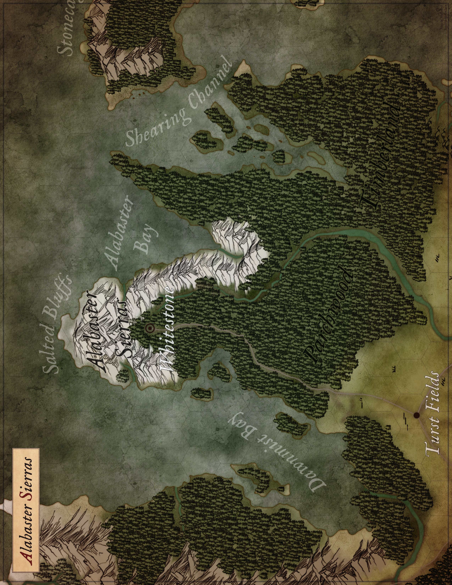

{.size-full .print-only}

(print-page)

{.size-cover .screen-only}
## Alabaster Sierras
[^Exandria^](geography) ^>^ [^Tal'Dorei^](taldorei) {.screen-only}

^Area:^ **^137,181^ ^sq^ ^mi^** ^-^ ^Population:^ **^4,865^**

The Alabaster Sierras are a wild, untamed wilderness tucked into the northeast corner of the continent of [Tal'Dorei](taldorei). While the region is named for the chalk-white [mountains](alabaster-sierra-range) that run through the heart of the region, it is dominated by the massive forest known as the [Parchwood Timberland](parchwood-timberland).

#### Climate
The [Alabaster Sierras](alabaster-sierras) have a **humid continental climate (Dfb)**. The winter is long and cold, and snowfall is common from late fall to early spring. The summers are warm, but relatively short with a fair amount of rain.

Compared to the other regions of [Tal'Dorei](taldorei), only the jungles of the [Rifenmist Peninsula](rifenmist-peninsula) receive more rainfall annually.

#### Demographics
| Race       |  % | Race      |  % |
|:-----------|:--:|:----------|:--:|
| Human      | 68 | Elf       |  6 |
| Halfling   |  7 | -         |    |
| Dwarf      |  7 | Other     |    |
{.gray}

The numbers above represent the region's only permanent settlement of [Whitestone](whitestone) and it's surrounding villages. They do not account for the many indigenous tribes that live deep within the [Parchwood Timberland](parchwood-timberland).

#### Economy
While rich in natural resources like stone and timber, the economy of the [Alabaster Sierras](alabaster-sierras) reolves around the magically infused "whitestone" that gives the [Alabaster Sierras](alabaster-sierra-range) their distinctive color.

(print-column)

#### Geography
The following features are located in this region:

- [Alabaster Bay](alabaster-bay)
- [Alabaster Sierras](alabaster-sierra-range)
- [Alabaster Trail](alabaster-trail)
- [Dawnmist Bay](dawnmist-bay)
- [Parchwood Bay](parchwood-bay)
- [Parchwood Timberland](parchwood-timberland)
- [Salted Bluffs](salted-bluffs)
- [Shearing Channel](shearing-channel)
- [Upper Mooren River Run](upper-mooren-river-run)

#### Government
While much of the [Alabaster Sierras](alabaster-sierras) is untamed wilderness, the city of [Whitestone](whitestone) and surrounding settlements fall under the protection of the **House of de Rolo** and the **Chamber of Whitestone**. 

[Whitestone](whitestone) maintains a cordial relationship with the **House of Tal'Dorei** in [Emon](emon), the city is largely isolated from the rest of the continent geographically and politically.

#### Religion
The dominant relgions in the region are the Prime Deities of **Pelor** and **Erathis**, but worshippers of **Avandra**, **Moradin**, **Melora** and **Corellon** are common as well.

Many of the indigenous Gnoll and Orc tribes in the southern [Parchwood](parchwood) are adherent followers of **Yeenoghu** and **Gruumsh** respectively and should be given a wide berth.

#### Settlements
The following settlements are located in this region:

- [Whitestone](whitestone)
{.square}

(print-page)

### Alabaster Bay
[^Exandria^](geography) ^>^ [^Tal'Dorei^](taldorei) ^>^ [^Alabaster^ ^Sierras^](alabaster-sierras) {.screen-only}

**^Type:^** ^Arctic,^ ^Coastal,^ ^&^ ^Underwater^

The Alabaster Bay is a large bay located on the eastern side of the [Alabaster Peninsula](alabaster-peninsula) in northeastern [Tal'Dorei](taldorei). The bay is located on the northern end of the [Shearing Channel](shearing-channel) but few ships enter it's waters. Most shipping turn east along the [Stonecage Cliffs](stonecage-cliffs) and northern coast of [Wildemount](wildemount) to [Icehaven](icehaven) and the islands of [Eiselcross](eiselcross).

The western shore of the bay is rocky and cold. The [Alabaster Sierras](alabaster-sierra-range) rise out of the water and shoot upward forming the eastern slope of the jagged peaks that stretch the entirety of the [Alabaster Peninsula](alabaster-peninsula). The southern shore, on the other hand, is relatively flat and heavily wooded with the [Parchwood Timberland](parchwood-timberland) coming right up to the water's edge.

The icy waters of the Alabaster Bay are home to large colonies of seals and is a favorite hunting ground for [sea lions](/monster/sea-lion) and [killer whales](/monster/killer-whale). While most of the creatures in the bay give vessels a wide berth, captains that brave these frigid waters are always on the lookout for [Chuul](/monster/chull) and [harpies](/monster/harpy) from the mountains to the west.

*^Canon^ ^Consistency:^ **^Medium^** ^-^ ^(Unnamed^ ^in^ ^official^ ^sources.)^* {.screen-only}

### Alabaster Sierra Range
[^Exandria^](geography) ^>^ [^Tal'Dorei^](taldorei) ^>^ [^Alabaster^ ^Sierras^](alabaster-sierras) {.screen-only}

**^Type:^** ^Mountain^

Named for their chalk-white color, the mountains of the [Alabaster Sierras](alabaster-sierra-range) stretch over three hundred miles along the eastern edge of the [Alabaster Peninsula](alabaster-sierras). They emerge from the [Parchwood Timberland](parchwood-timberland) in the south and run along the western shore of the [Alabaster Bay](alabaster-bay) before coming to an abrupt end at the towering [Salted Bluffs](salted-bluffs). 

Infused with magical energy, the [white stone](/item/white-stone) from which the mountains get their name is a hot commodity in arcane circles. While the raw stone has some magical properties, it's arcane power is greatly enhanced once it has been refined into a green glass-like substance called [residuum](/item/residuum). It is a lucrative export for the city of [Whitestone](whitestone) and numerous quarries dot the northern end of the Alabaster Sierras.

While not nearly as large as the massive [Cliffkeeps](cliffkeep-mountain-range) to the west, the [Alabaster Sierras](alabaster-sierras) are every bit as dangerous. [Behirs](/monster/behir), [harpies](/monster/harpy), and [wyverns](/monster/wyvern) are a constant threat to individuals that roam too far into the jagged peaks, as are the [stone giants](/monster/stone-giant) that call the many hidden valleys of the [Sierras](alabaster-sierra-range) home. Largely content to give the people of [Whitestone](whitestone) a wide berth, conflicts are becoming more common as settlers push east and north into giant lands.

*^Canon^ ^Consistency:^ **^High^** ^-^ ^(Tal'Dorei^ ^Campaign^ ^Guide,^ ^p.^ ^46)^* {.screen-only}

### Alabaster Trail
[^Exandria^](geography) ^>^ [^Tal'Dorei^](taldorei) ^>^ [^Alabaster^ ^Sierras^](alabaster-sierras) {.screen-only}

**^Type:^** ^Forest^

The [Alabaster Trail](alabaster-trail) is small road that connects the city of [Whitestone](whitestone) at the northern tip of the [Alabaster Peninsula](alabaster-sierras) to the rest of [Tal'Dorei](taldorei). It winds southward for a little more than 360 miles through the [Parchwood Timberland](parchwood-timberland) to the town of [Turst Fields](turst-fields) in the eastern [Dividing Plains](dividing-plains).

Travel on the trail is extremely dangerous. While the northern and southern ends are well patrolled by the [Paleguard](paleguard) and [Shields of the Plains](shields-of-the-plains) respectively, travelers attempting the journey are advised to join a caravan or hire escorts. 

[Bandits](/monster/bandit), [gnolls](/monster/gnoll) and [orcs](/monster/orcs) are a constant threat on the southern end, but even they avoid the stretch through the forest. Lycans, dire beasts, and undead creatures roam the [Timberland](parchwood-timberland) and it is not uncommon for them to attack travelers on the road and in their camps.

##### Travel
| Origin                 | Destination                | Miles |
|:-----------------------|:---------------------------|:-----:|
|[Whitestone](whitestone)|[Turst Fields](turst-fields)|  360  |
<!-- {table: .gray} -->

*^Canon^ ^Consistency:^ **^High^** ^-^ ^(Tal'Dorei^ ^Campaign^ ^Guide,^ ^p.^ ^46)^* {.screen-only}

### Dawnmist Bay
[^Exandria^](geography) ^>^ [^Tal'Dorei^](taldorei) ^>^ [^Alabaster^ ^Sierras^](alabaster-sierras) {.screen-only}

**^Type:^** ^Coastal^ ^&^ ^Underwater^

Located on the western side of the [Alabaster Peninsula](alabaster-sierras), the [Dawnmist Bay](dawnmist-bay) is a large, sheltered bay that drives deep into the continent of [Tal'Dorei](taldorei). While it is an extension of the [Frigid Depths](frigid-depths), the [Dawnmist](dawnmist-bay) is warmer and calmer than it's sister, the [Alabaster Bay](alabaster-bay) on the other side of the peninsula. 

Named for the heavy banks of fog that roll off the eastern slope of the [Cliffkeep Mountains](cliffkeep-mountain-range), the [Dawnmist Bay](dawnmist-bay) and its namesake forest, the [Dawnmist Pines](dawnmist-pines) are often obscured by fog. Only during the warm months of summer does the fog burn off by midday.

*^Canon^ ^Consistency:^ **^Medium^** ^-^ ^(Unnamed^ ^in^ ^official^ ^sources.)^* {.screen-only}

(print-page)

### Parchwood Bay
[^Exandria^](geography) ^>^ [^Tal'Dorei^](taldorei) ^>^ [^Alabaster^ ^Sierras^](alabaster-sierras) {.screen-only}

**^Type:^** ^Coastal^ ^&^ ^Underwater^

The [Parchwood Bay](parchwood-bay) is a large, island-choked bay located along the western side of the perilous [Shearing Channel](shearing-channel). While the bay may seem like an excellent shelter from the storms that plague the channel, it is every bit as dangerous. A veritable maze of islands and rocky shoals, few that venture into the bay come out unscathed. 

In addition to the environmental dangers, the [Parchwood Bay](parchwood-bay) is home to many dangerous creatures that prey on the ships that wander into the bay seeking refuge from the chaos of the channel. Even some of the braver [pirate captains](/monster/pirate-captain) operating out of [Darktow](darktow) have been known to hide in the bay and strike at the ships traversing the channel. 

*^Canon^ ^Consistency:^ **^Medium^** ^-^ ^(Unnamed^ ^in^ ^official^ ^sources.)^* {.screen-only}

### Parchwood Timberland
[^Exandria^](geography) ^>^ [^Tal'Dorei^](taldorei) ^>^ [^Alabaster^ ^Sierras^](alabaster-sierras) {.screen-only}

**^Type:^** ^Forest^

Dominating the northeastern corner of [Tal'Dorei](taldorei) is the dark and dense Parchwood Timberland. A massive forest, wild, untamed, and largely unexplored. Few dare to stray from the [Alabaster Trail](alabaster-trail) travelling between [Whitestone](whitestone) and [Turst Fields](turst-fields) and many who do are never seen again.

The Parchwood Timberland is an extremely dangerous forest that teems with monstrosities, undead, lycans, and corrupted plant-life. Even the [gnolls](gnolls) of eastern [Tal'Dorei](taldorei), like the [Moonsteeth](/monster/gnoll) and [Priest-Eaters](/monster/gnoll) stick to the southern edge of the forest.

The southern edge of the forest marks the southern boundary between the [Alabaster Sierras](alabaster-sierras) in the north and the [Dividing Plains](dividing-plains) and [Lucidian Coast](lucidian-coast) to the south.

*^Canon^ ^Consistency:^ **^High^** ^-^ ^(Tal'Dorei^ ^Campaign^ ^Guide,^ ^p.^ ^46)^* {.screen-only}

### Salted Bluffs
[^Exandria^](geography) ^>^ [^Tal'Dorei^](taldorei) ^>^ [^Alabaster^ ^Sierras^](alabaster-sierras) {.screen-only}

**^Type:^** ^Coastal^ ^&^ ^Mountain^

The Salted Bluffs are tall, seaside cliffs that run along the northern tip of the [Alabaster Peninsula](alabaster-sierras) where the [Alabaster Sierras](alabaster-sierra-range) meet the [Frigid Depths](frigid-depths). These towering cliffs are littered with caves and hidden coves and are frequently used by pirates and smugglers brave enough to work Exandria's northern ocean.

In addition to the pirates, [harpies](/monster/harpy) and [wyverns](/monster/wyvern) have been known to make their nests in the towering bluffs and strike at passing ships. It is an extremely dangerous area to sail and most merchant captains give the bluffs a wide berth.

*^Canon^ ^Consistency:^ **^High^** ^-^ ^(Tal'Dorei^ ^Campaign^ ^Guide,^ ^p.^ ^48)^* {.screen-only}

### Shearing Channel
[^Exandria^](geography) ^>^ [^Tal'Dorei^](taldorei) ^>^ [^Alabaster^ ^Sierras^](alabaster-sierras) {.screen-only}

**^Type:^** ^Coastal^ ^&^ ^Underwater^

The [Shearing Channel](shearing-channel) is a narrow passage between the continents of [Tal'Dorei](taldorei) in the west and [Wildemount](wildemount) in the east. It connects the remote ports on the [Frigid Depths](frigid-depths) from the [Lucidian Ocean](lucidian-ocean) and the rest of [Exandria](exandria). Extreme weather and rough seas are a constant threat as our the various creatures that hide in the nearby [Parchwood Bay](parchwood-bay).

*^Canon^ ^Consistency:^ **^High^** ^-^ ^(Tal'Dorei^ ^Campaign^ ^Guide,^ ^p.^ ^46)^* {.screen-only}

### Upper Mooren River Run
[^Exandria^](geography) ^>^ [^Tal'Dorei^](taldorei) ^>^ [^Alabaster^ ^Sierras^](alabaster-sierras) {.screen-only}

**^Type:^** ^Forest^

The Upper Mooren River Run begins its nearly 600 mile journey high in the [Alabaster Sierras](alabaster-sierra-range) and ends in the town of [Drynna](drynna) on the northwestern shore of [Mooren Lake](mooren-lake), passing the city of [Whitestone](whitestone) along the way.

As the river makes it's way south, it gains strength from countless streams and smaller rivers that flow down from the Alabasters along the way. It roars through the [Parchwood Timberland](parchwood-timberland) and then widens and slows through the eastern [Dividing Plains](dividing-plains).

The Upper Mooren River Run is barely navigable. There are numerous falls and intense rapids at various points along the river. It is most certainly a one-way trip with travel up-river impossible by non-magical means.

*^Canon^ ^Consistency:^ **^High^** ^-^ ^(Tal'Dorei^ ^Campaign^ ^Guide,^ ^p.^ ^46)^* {.screen-only}

> While technically the same river, the portions of the Mooren River Run above and below [Mooren Lake](mooren-lake) could not be more different. As such, I have created a seperate entry for the [Lower Mooren River Run](lower-mooren-river-run) in the [Lucidian Coast](lucidian-coast) region.
> 
> \- *Farland* {.text-right}
>
> {.center}
<!-- {blockquote:.flavortext} -->

(print-page)

### Whitestone
[^Exandria^](geography) ^>^ [^Tal'Dorei^](taldorei) ^>^ [^Alabaster^ ^Sierras^](alabaster-sierras) {.screen-only}

**^Population:^** ^4,230^ ^-^ **^Area:^** ^28^ ^Hectares^ ^/^ ^69^ ^Acres^

The city of [Whitestone](whitestone) is located in the far northeastern corner of [Tal'Dorei](taldorei) at the northern end of the [Alabaster Peninsula](alabaster-sierras). The city lies at the base of the [Alabaster Sierras](alabaster-sierra-range) where the mountains wrap around the northern tip of the peninsula. The massive [Parchwood Timberland](parchwood-timberland) completely surrounds the city and it is connected to the rest of [Tal'Dorei](taldorei) by the [Alabaster Trail](alabaster-trail).

#### Defenses
Given the city's location in the dangerous [Parchwood Timberland](parchwood-timberland) and at the base of the [Alabaster Sierras](alabaster-sierra-range), the defense of the city is a high priority. The city is protected by a large, stone wall that completely envelops the city and heavy gates protect the many entrances into the city from the surrounding communities and to the [Alabaster Trail](alabaster-trail).

**Pale Guard (42)**. The [Pale Guard](pale-guard) are the chief protectors of the city and the surrounding villages. They stand post on the city's walls, patrol northern end of the [Alabaster Trail](alabaster-trail) and serve as the city's police force.

**Whitestone Riflemen (20)**. The [Whitestone Riflemen](whitestone-riflemen) are an elite unit, equipped with firearms and tasked with the defense of [Castle Whitestone](castle-whitestone) and the [de Rolo](house-de-rolo) family.

**Grey Hunt (8)**. The [Grey Hunt](grey-hunt) is a small cadre of rangers that patrol the [Parchwood](parchwood-timberland) and keep the various monsters that roam the wood away from the city and it's inhabitants.

##### Illusory Barrier

In addition to the traditional defenses, the city is protected by an [Illusory Barrier](illusory-barrier) that hides the city from above. The barrier is a collection of obelisks made of [white stone](/item/white-stone) and positioned around the city. When activated, they form an illusory dome of unspoiled wilderness over the entire city.

The barrier is powered by the expenditure of magical energy. All five obelisks must be active at the same time for the barrier to work.
- 2 Hours = 1 spell level x 5
{.square}

#### Demographics
[Whitestone](whitestone) is overwhelmingly human with small, but lively dwarven and halfling communities.
- Human (83%)
- Halfling (7%)
- Dwarf (6%)
- Other (4%)
{.square}

#### Government
The city-state of [Whitestone](whitestone) is governed by a ruling council known as the [Chamber of Whitestone](chamber-of-whitestone). Comprised of seven individuals, the leader of the council is the Guardian of Woven Stone and is held by the current head of the [de Rolo](house-de-rolo) family. The remaining members are chosen from the local nobility and from prominent leaders in the community.

(print-page)

{.size-full .print-only}

##### Architecture
Buildings in Whitestone are mostly built from expertly cut stone and lumber. The architectural style is reminiscent of buildings from the [de Rolo's](house-of-de-rolo) native [Wildemount](wildemount).

##### Defenses
Whitestone has a large, stone wall that completely encompasses the entire city. A number of gates allow local citizens to pass in and out of the city and each gate is well-guarded by the city's [Paleguard](paleguard).

On a hill overlooking the city is a large keep called [Castle Whitestone](castle-whitestone). the keep is home to the [de Rolo family](house-of-de-rolo) and [Chamber of Whitestone](chamber-of-whitestone). It is defended by an elite, firearm equipped unit called the [Whitestone Riflemen](whitestone-riflemen).

While the nearby villages are patrolled by the [Paleguard](paleguard), the [Grey Hunt](grey-hunt) protect the city by hunting monstrosities and beasts in the surrounding [Parchwood Timberland](parchwood-timberland) and [Alabaster Sierra Range](alabaster-sierra-range).

In addition to the traditional defenses, the city of Whitestone is protected by an Illusory Barrier that was built during in 815 PD. 
##### Demographics

##### Government
The city of Whitestone is governed by the [Chamber of Whitestone](chamber-of-whitestone), a council led by the [de Rolo family](house-of-de-rolo) and includes leaders from the community.

##### Law & Order
Crime is low in Whitestone. The [Clasp](clasp) and [Myriad](myriad) maintain some presence in the city, but not nearly to the extent in the other cities of [Tal'Dorei](taldorei). 

##### Religion
The dominant religion in Whitestone is that of [Pelor](pelor). The [de Rolos](house-de-rolo) are ardent supporters of the Dawn Father and their faith played a pivotal role in the city's founding.

The [Sun Tree](sun-tree) in Dawnfather Square is a constant reminder of the city's devotion to [Pelor](pelor) as is the [Zenith](zenith) in the Greyfields.

While not as prevalent as [Pelor](pelor), [Erathis the Law Bearer](erathis) also has a strong presence in the city. The [Lady's Chamber](ladys-chamber) is located in the southwestern corner of the city in the Common Ward.

Worship of the [Raven Queen](raven-queen) became more common in 815 PD when the [Altar of the Raven](altar-of-the-raven) was constructed behind the [Temple of the Dawn](temple-of-the-dawn) in the Greyfields.

(print-page)

##### Services
Despite being a relatively small city, Whitestone's remote location and history of isolationism have made the city more self-sufficient than other cities of its size might be. As a result, it has a little more to offer in the way of professional services.

| Service ^sv^              |  #  | Service ^sv^              |  #  |
|:--------------------------|:---:|:--------------------------|:---:|
| Alchemists ^3000^         | 1.5 | Leatherworkers ^2000^     | 2.1 |
| Armorsmiths ^3000^        | 1.5 | Locksmiths ^1900^         | 2.2 |
| Blacksmiths ^1500^        | 2.8 | Magic Shops ^5600^        | 0.8 |
| Booksellers ^6300^        | 0.7 | Magic Supply ^2800^       | 1.5 |
| Cart/Shipwrights ^6000^   | 0.7 | Merchant (General) ^700^  | 6.0 |
| Enchanters ^9000^         | 0.5 | Merchant (Special) ^1400^ | 3.0 |
| Inns / Stables ^2000^     | 2.1 | Weaponsmiths ^2300^       | 1.8 |
<!-- {table: .gray} -->

> ***Note:** Support value is the # of people needed to support a given service. This is just a helpful guide. There are always execptions. Also, a settlement too small for a dedicated service, does not mean that service is not available.*
<!-- {blockquote: .paper} -->

##### Society
The people of Whitestone are tough folk. The city was founded by the [de Rolo family](house-of-de-rolo) in the early 600s and a frontier spirit has become central to their ethos. That combined with years of occupation under the Briarwoods in the early 800s has created a culture that prides itself on self-reliance and perserverance.

##### Trade & Industry
The chief export of the city is a chalk-white rock called 'whitestone' that is infused with magical properties. The material can be refined into a green glass-like substance called residuum that increases its potency. It has a number of uses to arcane spellcasters and is highly desired by mages throughout [Exandria](geography). The material can be refined into a green glass-like substance called residuum that increases its potency.

> While the majority of this page is canon, some details like the settlement's land area, number of guards, and available services are based on the guide "Medieval Demographics Made Easy". They help develop the settlement in ways that are not provided in canon sources, but do so in a believable manner.
> - Tal'Dorei Campaign Setting Guide, p. 48
> - [Critical Role Wiki - Whitestone](https://criticalrole.fandom.com/wiki/Whitestone) (External Link)
> - [C1E29 "Whispers"](https://crtranscript.tumblr.com/ep029) (External Link)		
> - [C1E64 "Frigid Doom"](https://crtranscript.tumblr.com/ep064) (External Link)	
> - [C1E70 "Trust"](https://crtranscript.tumblr.com/ep070) (External Link)
> - [Medieval Demographics Made Easy by S. John Ross](https://gamingballistic.com/2018/11/05/medieval-demographics-made-easy-by-s-john-ross/) (External Link)
>
> *Canon Consistency (80%)*
> {.center}
<!-- {blockquote:.flavortext} -->

>  ^Learn^ ^More^
> - Tal'Dorei Campaign Setting Guide, p. 86
<!-- {blockquote:.read} -->

|||
|:---------------------|:-------------------------|
|  ||
| Continent            | [Tal'Dorei](taldorei)    |
| Region               | [Alabaster Sierras](alabaster-sierras) |
| Population           | 4,230                    |
| Pop. Density         | Medium (150 / hectare)   |
| Land Mass            | 28 hectares / 69 Acres   |
| Demographics (Top 3) | [Humans](humans) (83%), [Halflings](halflings) (7%), [Dwarves](dwarves) (6%), [Other](races) (4%) |
| Affiliation  | [Chamber of Whitestone](chamber-of-whitestone) |
| Factions (Guard)     | [Paleguard](paleguard) (42), [Whitestone Riflemen](whitestone-riflemen) (20), [Grey Hunt](grey-hunt) (8) |
| Founded              | ~614 PD                  |
| Ruined               | -                        |
{.sidebar}
(print-page)

This space intentionally left blank.
**Castle Ward**. The Castle Ward is home to [Castle Whitestone](castle-whitestone) and its grounds. It is on the north end of the city and up on a hill that overlooks the entire city.
- [Castle Whitestone](castle-whitestone)
- [Whitestone Riflemen Barracks](whitestone-riflemen)

**Common Ward**. The Common Ward is a working class neighborhood on the southern side of the city. It is just inside the main gate off the [Alabaster Trail](alabaster-trail).
- [Estate of the Mistress of the Grey Hunt](grey-hunt)
- [Lady's Chamber](ladys-chamber)

**Dawnfather Square**. The heart of the city, Dawnfather Square is a large square filled with shops, market stalls, and inns. At the center of the Square stands the massive [Sun Tree](sun-tree).
- [Sun Tree](sun-tree)
- [Ziggurat of Whitestone](ziggurat-of-whitestone)

**Greyfields**. The Greyfields is the cemetary and temple district of the city and houses temples to [Pelor](pelor) and the [Raven Queen](raven-queen).
- [Altar of the Raven](altar-of-the-raven)
- [Zenith](zenith)

**Northern Ward**. The Northern Ward is the more affluent part of the city and sits between Dawnfather Square and the Castle Ward.
- [Paleguard Barracks](paleguard-barracks)

**Surrounding Area**. The city of Whitestone is surrounded by the [Parchwood Timberland](parchwood-timberland) and living outside the city is dangerous. Still, small farming communities, lumber and mining camps dot the landscape.

(print-page)
