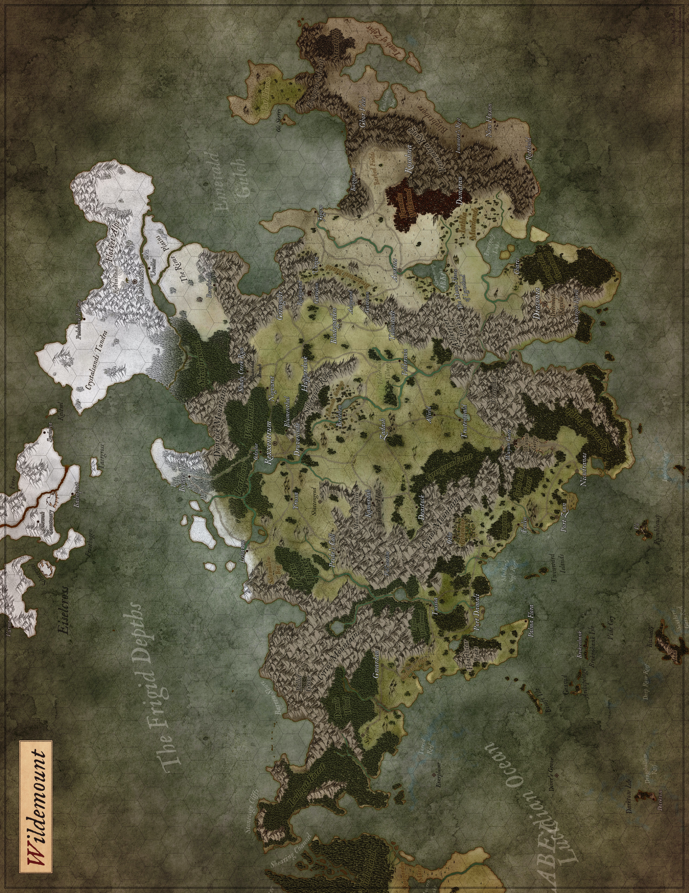{.size-full .print-only}

(print-page)

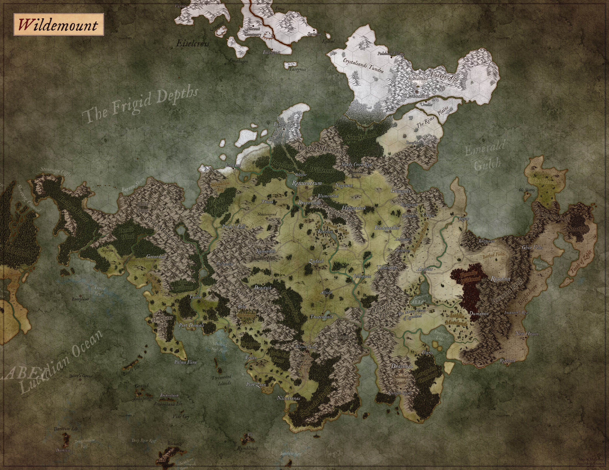{.size-cover .screen-only}
# Wildemount
Lorem ipsum dolor sit amet, consectetur adipiscing elit, sed do eiusmod tempor incididunt ut labore et dolore magna aliqua. Ut enim ad minim veniam, quis nostrud exercitation ullamco laboris nisi ut aliquip ex ea commodo consequat. Duis aute irure dolor in reprehenderit in voluptate velit esse cillum dolore eu fugiat nulla pariatur. Excepteur sint occaecat cupidatat non proident, sunt in culpa qui officia deserunt mollit anim id est laborum.

(print-page)

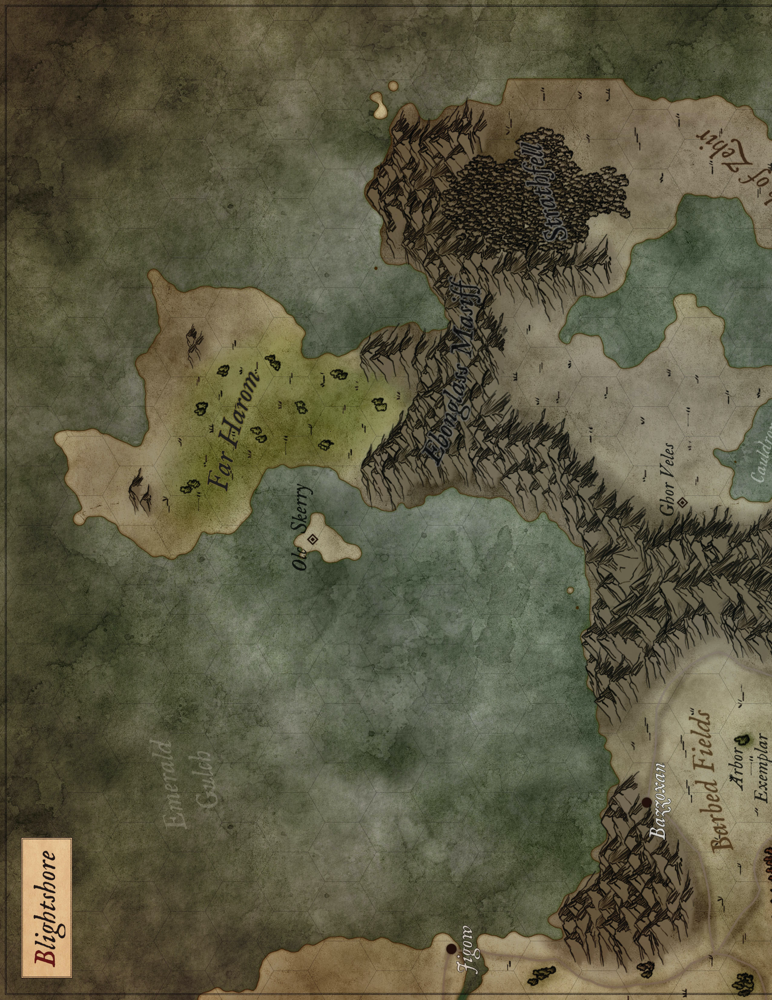{.size-full .print-only}

(print-page)

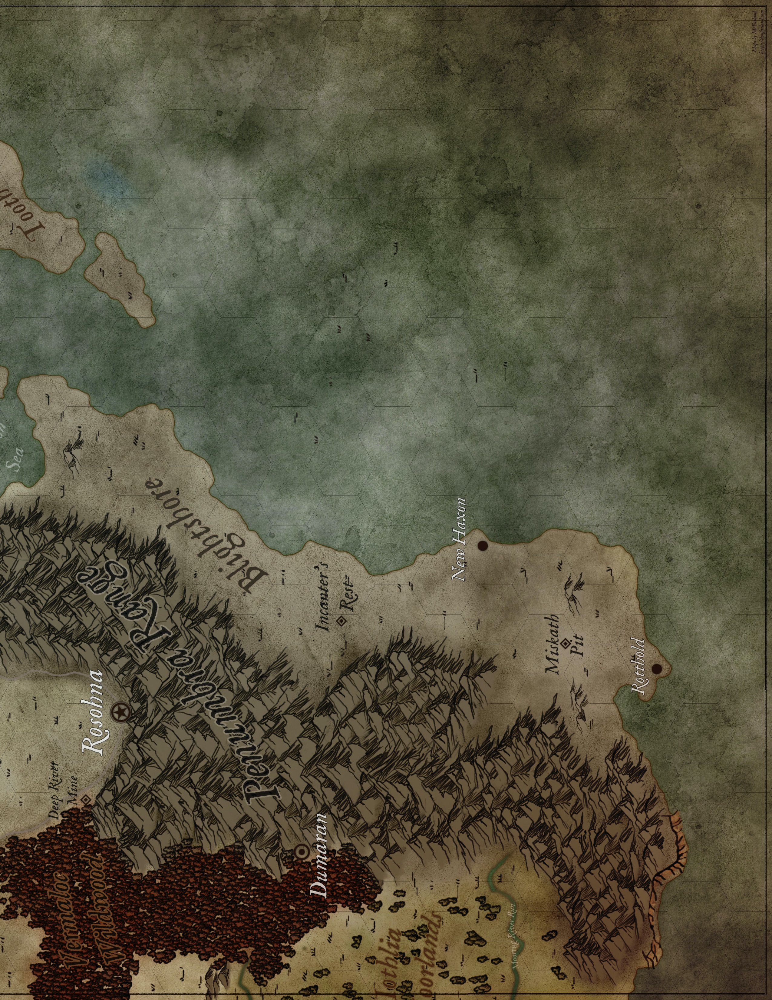{.size-full .print-only}

(print-page)

{.size-cover .screen-only}

## Blightshore
[^Exandria^](geography) ^>^ [^Wildemount^](wildemount)

^Area:^ **^000,000^ ^sq^ ^mi^** ^-^ ^Population:^ **^00,000^**

Lorem ipsum dolor sit amet, consectetur adipiscing elit. Proin libero diam, tempor sed mauris ac, aliquet dapibus lectus. Donec vulputate sem nunc, eget sagittis est tempor eget. Aliquam eleifend consequat ultricies. Cras euismod porttitor neque, ut condimentum ante placerat nec.

##### Climate
Lorem ipsum dolor sit amet, consectetur adipiscing elit. Proin libero diam, tempor sed mauris ac, aliquet dapibus lectus. Donec vulputate sem nunc, eget sagittis est tempor eget. Aliquam eleifend consequat ultricies. Cras euismod porttitor neque, ut condimentum ante placerat nec.

| |~Spring~|~Summer~|~Fall~|~Winter~|
|:-----|:----:|:----:|:----:|:----:|
| High | 00°  | 00°  | 00°  | 00°  |
| Low  | 00°  | 00°  | 00°  | 00°  |
| Rain | 0.0" | 0.0" | 0.0" | 0.0" |
| Snow | 0.0" | 0.0" | 0.0" | 0.0" | 
{.gray}

*^All^ ^numbers^ ^are^ ^monthly^ ^averages^ ^for^ ^the^ ^season.^*

##### Demographics
Lorem ipsum dolor sit amet, consectetur adipiscing elit. Proin libero diam, tempor sed mauris ac, aliquet dapibus lectus. Donec vulputate sem nunc, eget sagittis est tempor eget. Aliquam eleifend consequat ultricies. Cras euismod porttitor neque, ut condimentum ante placerat nec.

|||||||
|:-----------|:---:|:-----------|:---:|:-----------|:---:|
| -          | -   | -          | -   | -          | -   |
| -          | -   | -          | -   | Other      | -   |
{.gray}

##### Factions
The dominant factions in the region are:
- **Faction**. 
- **Faction**. 
- **Faction**. 
- **Faction**. 
- **Faction**. 
{.square}

##### Geography
The prominent geographical features in the region are:
- Geography
{.square}

##### Settlements
The major settlements in the region are:
- Settlement
{.square}

(print-page)

(print-page)

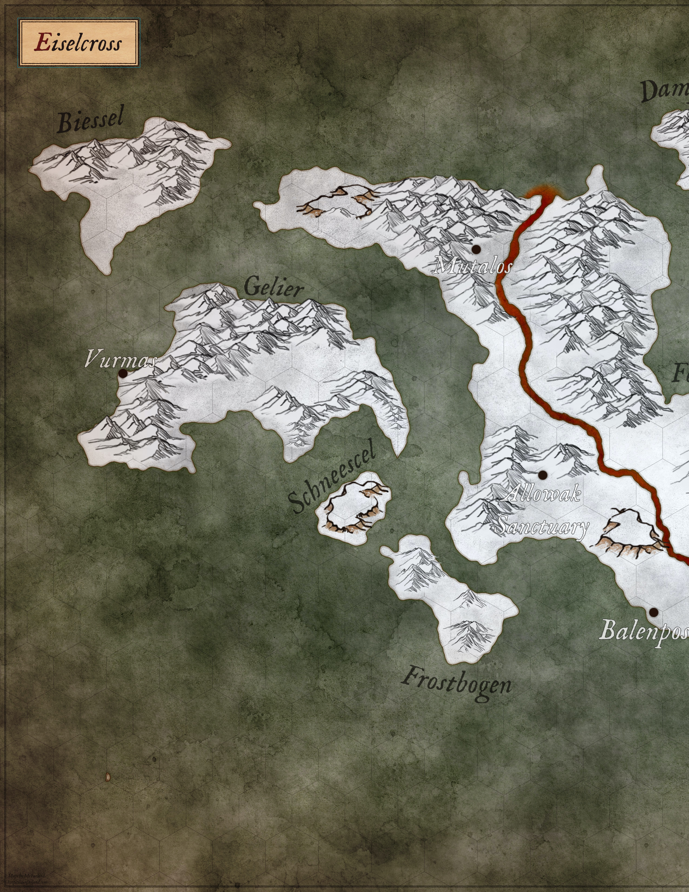{.size-full .print-only}

(print-page)

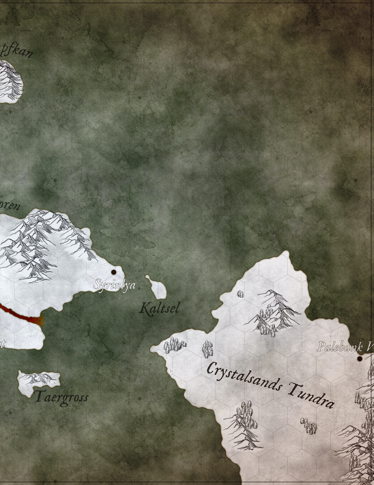{.size-full .print-only}

(print-page)

{.size-cover .screen-only}

## Eiselcross
[^Exandria^](geography) ^>^ [^Wildemount^](wildemount)

^Area:^ **^000,000^ ^sq^ ^mi^** ^-^ ^Population:^ **^00,000^**

Lorem ipsum dolor sit amet, consectetur adipiscing elit. Proin libero diam, tempor sed mauris ac, aliquet dapibus lectus. Donec vulputate sem nunc, eget sagittis est tempor eget. Aliquam eleifend consequat ultricies. Cras euismod porttitor neque, ut condimentum ante placerat nec.

##### Climate
Lorem ipsum dolor sit amet, consectetur adipiscing elit. Proin libero diam, tempor sed mauris ac, aliquet dapibus lectus. Donec vulputate sem nunc, eget sagittis est tempor eget. Aliquam eleifend consequat ultricies. Cras euismod porttitor neque, ut condimentum ante placerat nec.

| |~Spring~|~Summer~|~Fall~|~Winter~|
|:-----|:----:|:----:|:----:|:----:|
| High | 00°  | 00°  | 00°  | 00°  |
| Low  | 00°  | 00°  | 00°  | 00°  |
| Rain | 0.0" | 0.0" | 0.0" | 0.0" |
| Snow | 0.0" | 0.0" | 0.0" | 0.0" | 
{.gray}

*^All^ ^numbers^ ^are^ ^monthly^ ^averages^ ^for^ ^the^ ^season.^*

##### Demographics
Lorem ipsum dolor sit amet, consectetur adipiscing elit. Proin libero diam, tempor sed mauris ac, aliquet dapibus lectus. Donec vulputate sem nunc, eget sagittis est tempor eget. Aliquam eleifend consequat ultricies. Cras euismod porttitor neque, ut condimentum ante placerat nec.

|||||||
|:-----------|:---:|:-----------|:---:|:-----------|:---:|
| -          | -   | -          | -   | -          | -   |
| -          | -   | -          | -   | Other      | -   |
{.gray}

##### Factions
The dominant factions in the region are:
- **Faction**. 
- **Faction**. 
- **Faction**. 
- **Faction**. 
- **Faction**. 
{.square}

##### Geography
The prominent geographical features in the region are:
- Geography
{.square}

##### Settlements
The major settlements in the region are:
- Settlement
{.square}

(print-page)

This page intentionally left blank ... for now.

(print-page)

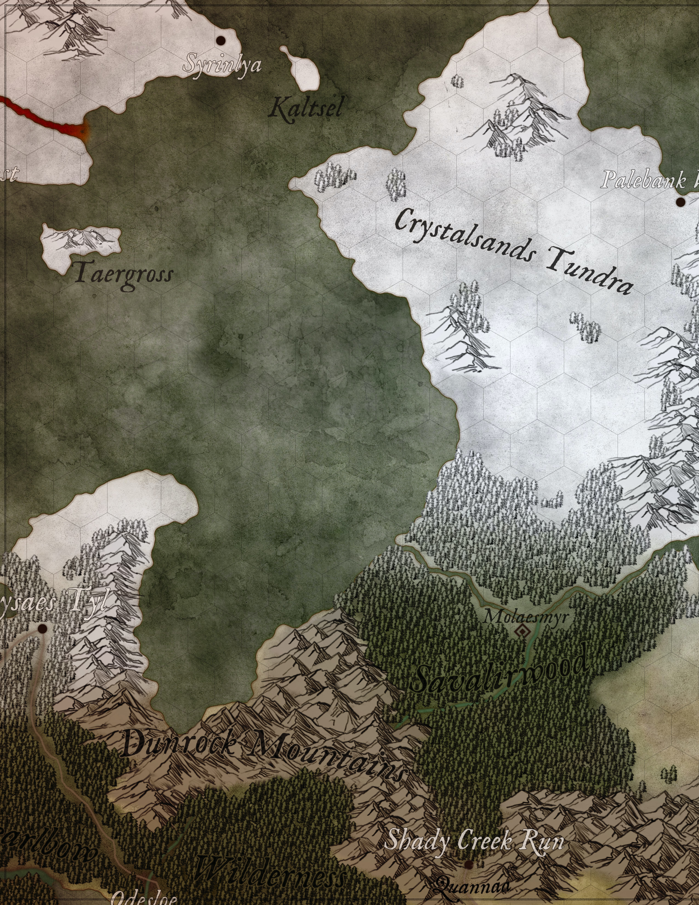{.size-full .print-only}

(print-page)

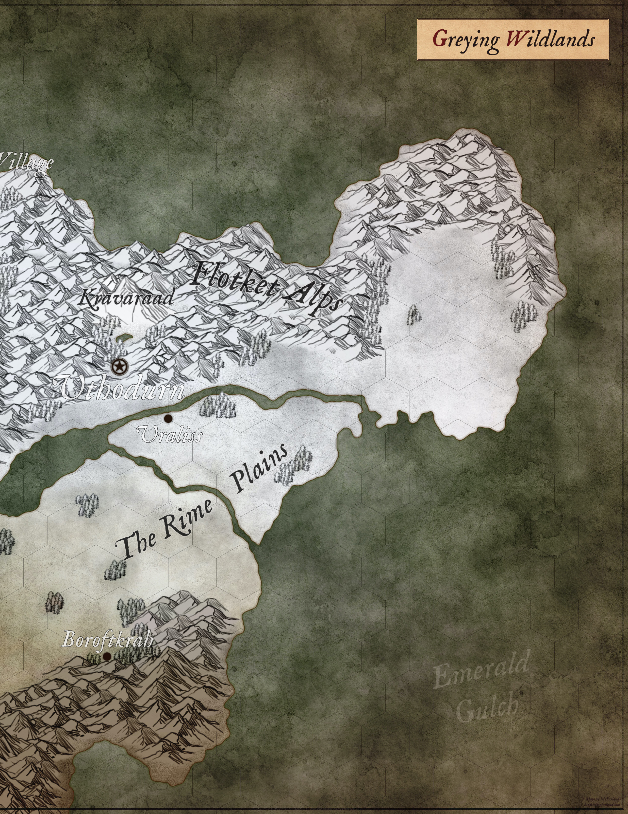{.size-full .print-only}

(print-page)

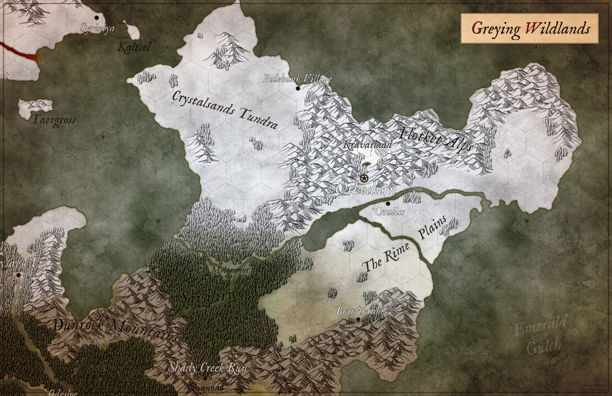{.size-cover .screen-only}

## Greying Wildlands
[^Exandria^](geography) ^>^ [^Wildemount^](wildemount)

^Area:^ **^000,000^ ^sq^ ^mi^** ^-^ ^Population:^ **^00,000^**

Lorem ipsum dolor sit amet, consectetur adipiscing elit. Proin libero diam, tempor sed mauris ac, aliquet dapibus lectus. Donec vulputate sem nunc, eget sagittis est tempor eget. Aliquam eleifend consequat ultricies. Cras euismod porttitor neque, ut condimentum ante placerat nec.

##### Climate
Lorem ipsum dolor sit amet, consectetur adipiscing elit. Proin libero diam, tempor sed mauris ac, aliquet dapibus lectus. Donec vulputate sem nunc, eget sagittis est tempor eget. Aliquam eleifend consequat ultricies. Cras euismod porttitor neque, ut condimentum ante placerat nec.

| |~Spring~|~Summer~|~Fall~|~Winter~|
|:-----|:----:|:----:|:----:|:----:|
| High | 00°  | 00°  | 00°  | 00°  |
| Low  | 00°  | 00°  | 00°  | 00°  |
| Rain | 0.0" | 0.0" | 0.0" | 0.0" |
| Snow | 0.0" | 0.0" | 0.0" | 0.0" | 
{.gray}

*^All^ ^numbers^ ^are^ ^monthly^ ^averages^ ^for^ ^the^ ^season.^*

##### Demographics
Lorem ipsum dolor sit amet, consectetur adipiscing elit. Proin libero diam, tempor sed mauris ac, aliquet dapibus lectus. Donec vulputate sem nunc, eget sagittis est tempor eget. Aliquam eleifend consequat ultricies. Cras euismod porttitor neque, ut condimentum ante placerat nec.

|||||||
|:-----------|:---:|:-----------|:---:|:-----------|:---:|
| -          | -   | -          | -   | -          | -   |
| -          | -   | -          | -   | Other      | -   |
{.gray}

##### Factions
The dominant factions in the region are:
- **Faction**. 
- **Faction**. 
- **Faction**. 
- **Faction**. 
- **Faction**. 
{.square}

##### Geography
The prominent geographical features in the region are:
- Geography
{.square}

##### Settlements
The major settlements in the region are:
- Settlement
{.square}

(print-page)

This page intentionally left blank ... for now.

(print-page)

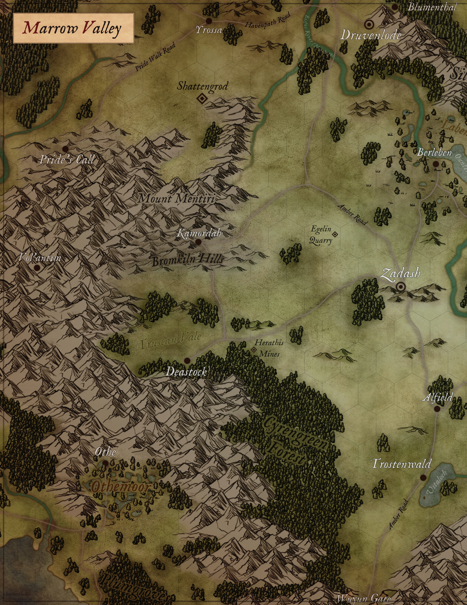{.size-full .print-only}

(print-page)

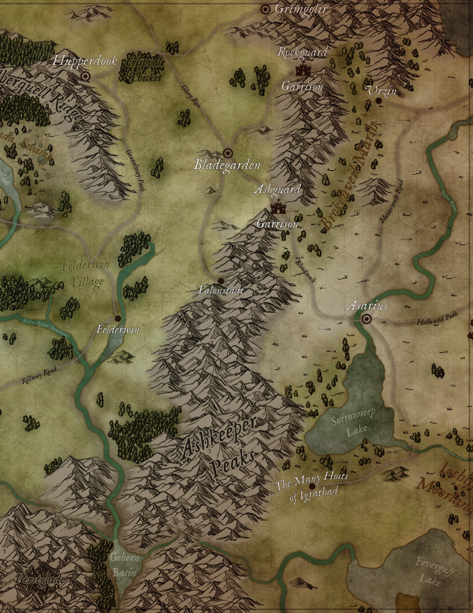{.size-full .print-only}

(print-page)

{.size-cover .screen-only}

## Marrow Valley
[^Exandria^](geography) ^>^ [^Wildemount^](wildemount)

^Area:^ **^000,000^ ^sq^ ^mi^** ^-^ ^Population:^ **^00,000^**

Lorem ipsum dolor sit amet, consectetur adipiscing elit. Proin libero diam, tempor sed mauris ac, aliquet dapibus lectus. Donec vulputate sem nunc, eget sagittis est tempor eget. Aliquam eleifend consequat ultricies. Cras euismod porttitor neque, ut condimentum ante placerat nec.

##### Climate
Lorem ipsum dolor sit amet, consectetur adipiscing elit. Proin libero diam, tempor sed mauris ac, aliquet dapibus lectus. Donec vulputate sem nunc, eget sagittis est tempor eget. Aliquam eleifend consequat ultricies. Cras euismod porttitor neque, ut condimentum ante placerat nec.

| |~Spring~|~Summer~|~Fall~|~Winter~|
|:-----|:----:|:----:|:----:|:----:|
| High | 00°  | 00°  | 00°  | 00°  |
| Low  | 00°  | 00°  | 00°  | 00°  |
| Rain | 0.0" | 0.0" | 0.0" | 0.0" |
| Snow | 0.0" | 0.0" | 0.0" | 0.0" | 
{.gray}

*^All^ ^numbers^ ^are^ ^monthly^ ^averages^ ^for^ ^the^ ^season.^*

##### Demographics
Lorem ipsum dolor sit amet, consectetur adipiscing elit. Proin libero diam, tempor sed mauris ac, aliquet dapibus lectus. Donec vulputate sem nunc, eget sagittis est tempor eget. Aliquam eleifend consequat ultricies. Cras euismod porttitor neque, ut condimentum ante placerat nec.

|||||||
|:-----------|:---:|:-----------|:---:|:-----------|:---:|
| -          | -   | -          | -   | -          | -   |
| -          | -   | -          | -   | Other      | -   |
{.gray}

##### Factions
The dominant factions in the region are:
- **Faction**. 
- **Faction**. 
- **Faction**. 
- **Faction**. 
- **Faction**. 
{.square}

##### Geography
The prominent geographical features in the region are:
- Geography
{.square}

##### Settlements
The major settlements in the region are:
- Settlement
{.square}

(print-page)

This page intentionally left blank ... for now.

(print-page)

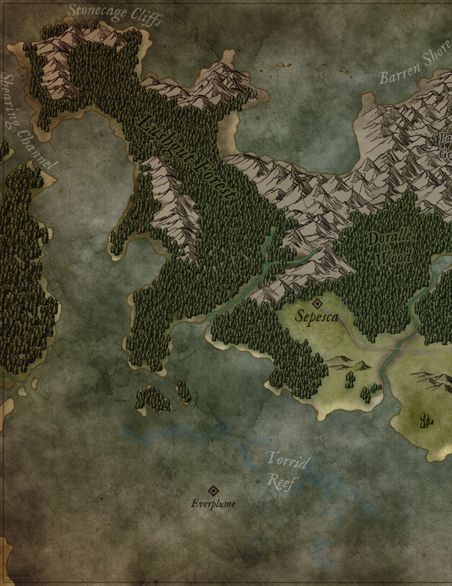{.size-full .print-only}

(print-page)

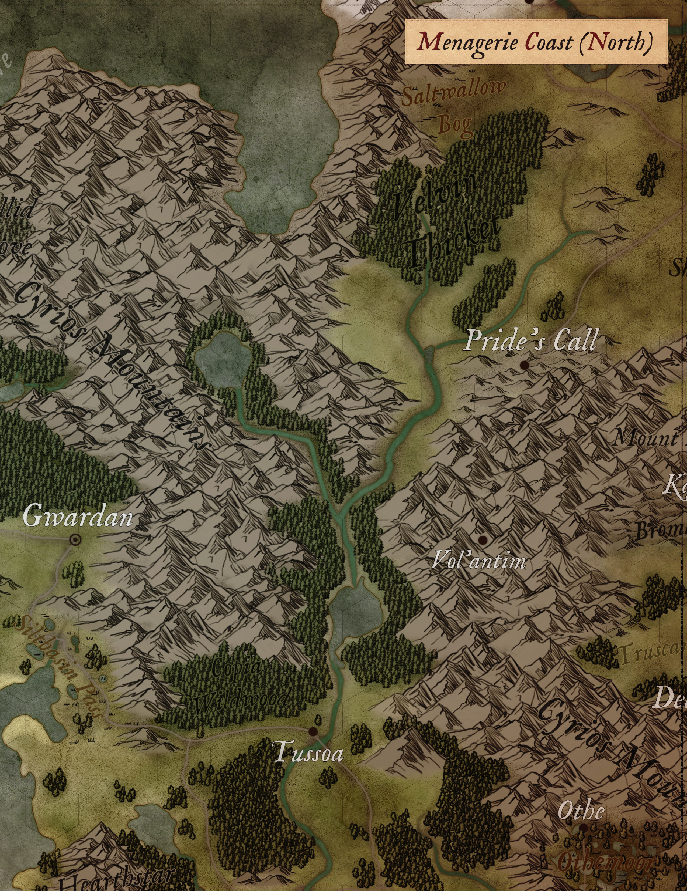{.size-full .print-only}

(print-page)

{.size-cover .screen-only}

## Menagerie Coast (North)
[^Exandria^](geography) ^>^ [^Wildemount^](wildemount)

^Area:^ **^000,000^ ^sq^ ^mi^** ^-^ ^Population:^ **^00,000^**

Lorem ipsum dolor sit amet, consectetur adipiscing elit. Proin libero diam, tempor sed mauris ac, aliquet dapibus lectus. Donec vulputate sem nunc, eget sagittis est tempor eget. Aliquam eleifend consequat ultricies. Cras euismod porttitor neque, ut condimentum ante placerat nec.

##### Climate
Lorem ipsum dolor sit amet, consectetur adipiscing elit. Proin libero diam, tempor sed mauris ac, aliquet dapibus lectus. Donec vulputate sem nunc, eget sagittis est tempor eget. Aliquam eleifend consequat ultricies. Cras euismod porttitor neque, ut condimentum ante placerat nec.

| |~Spring~|~Summer~|~Fall~|~Winter~|
|:-----|:----:|:----:|:----:|:----:|
| High | 00°  | 00°  | 00°  | 00°  |
| Low  | 00°  | 00°  | 00°  | 00°  |
| Rain | 0.0" | 0.0" | 0.0" | 0.0" |
| Snow | 0.0" | 0.0" | 0.0" | 0.0" | 
{.gray}

*^All^ ^numbers^ ^are^ ^monthly^ ^averages^ ^for^ ^the^ ^season.^*

##### Demographics
Lorem ipsum dolor sit amet, consectetur adipiscing elit. Proin libero diam, tempor sed mauris ac, aliquet dapibus lectus. Donec vulputate sem nunc, eget sagittis est tempor eget. Aliquam eleifend consequat ultricies. Cras euismod porttitor neque, ut condimentum ante placerat nec.

|||||||
|:-----------|:---:|:-----------|:---:|:-----------|:---:|
| -          | -   | -          | -   | -          | -   |
| -          | -   | -          | -   | Other      | -   |
{.gray}

##### Factions
The dominant factions in the region are:
- **Faction**. 
- **Faction**. 
- **Faction**. 
- **Faction**. 
- **Faction**. 
{.square}

##### Geography
The prominent geographical features in the region are:
- Geography
{.square}

##### Settlements
The major settlements in the region are:
- Settlement
{.square}

(print-page)

This page intentionally left blank ... for now.

(print-page)

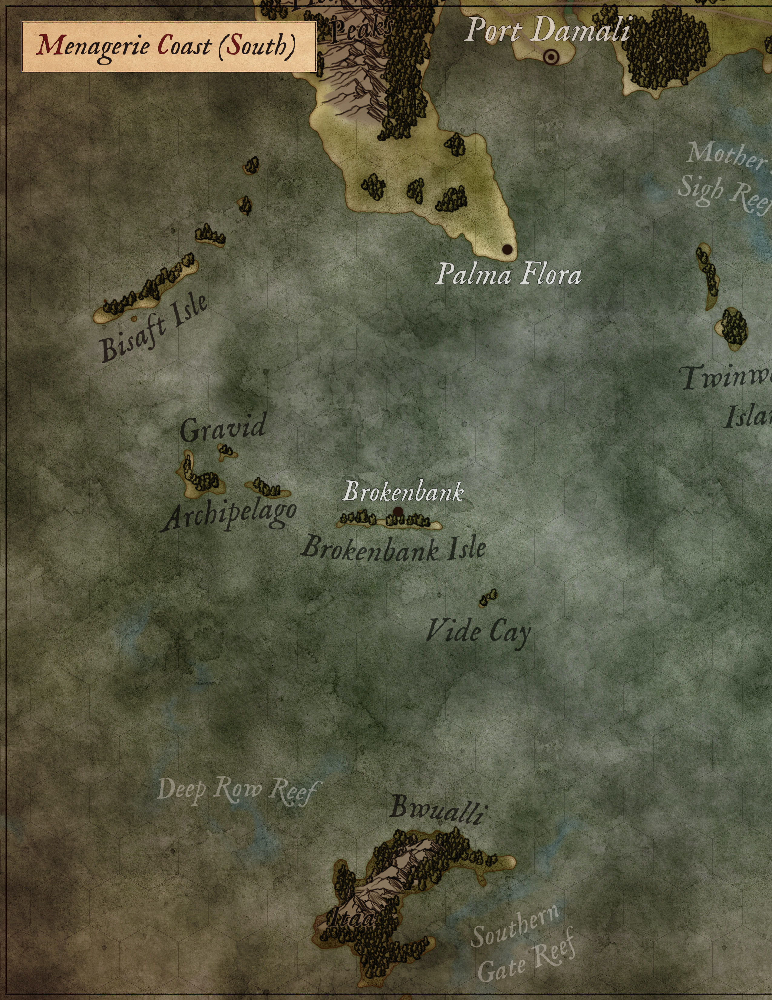{.size-full .print-only}

(print-page)

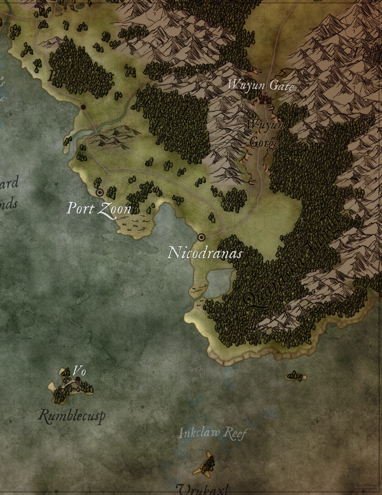{.size-full .print-only}

(print-page)

{.size-cover .screen-only}

## Menagerie Coast (South)
[^Exandria^](geography) ^>^ [^Wildemount^](wildemount)

^Area:^ **^000,000^ ^sq^ ^mi^** ^-^ ^Population:^ **^00,000^**

Lorem ipsum dolor sit amet, consectetur adipiscing elit. Proin libero diam, tempor sed mauris ac, aliquet dapibus lectus. Donec vulputate sem nunc, eget sagittis est tempor eget. Aliquam eleifend consequat ultricies. Cras euismod porttitor neque, ut condimentum ante placerat nec.

##### Climate
Lorem ipsum dolor sit amet, consectetur adipiscing elit. Proin libero diam, tempor sed mauris ac, aliquet dapibus lectus. Donec vulputate sem nunc, eget sagittis est tempor eget. Aliquam eleifend consequat ultricies. Cras euismod porttitor neque, ut condimentum ante placerat nec.

| |~Spring~|~Summer~|~Fall~|~Winter~|
|:-----|:----:|:----:|:----:|:----:|
| High | 00°  | 00°  | 00°  | 00°  |
| Low  | 00°  | 00°  | 00°  | 00°  |
| Rain | 0.0" | 0.0" | 0.0" | 0.0" |
| Snow | 0.0" | 0.0" | 0.0" | 0.0" | 
{.gray}

*^All^ ^numbers^ ^are^ ^monthly^ ^averages^ ^for^ ^the^ ^season.^*

##### Demographics
Lorem ipsum dolor sit amet, consectetur adipiscing elit. Proin libero diam, tempor sed mauris ac, aliquet dapibus lectus. Donec vulputate sem nunc, eget sagittis est tempor eget. Aliquam eleifend consequat ultricies. Cras euismod porttitor neque, ut condimentum ante placerat nec.

|||||||
|:-----------|:---:|:-----------|:---:|:-----------|:---:|
| -          | -   | -          | -   | -          | -   |
| -          | -   | -          | -   | Other      | -   |
{.gray}

##### Factions
The dominant factions in the region are:
- **Faction**. 
- **Faction**. 
- **Faction**. 
- **Faction**. 
- **Faction**. 
{.square}

##### Geography
The prominent geographical features in the region are:
- Geography
{.square}

##### Settlements
The major settlements in the region are:
- Settlement
{.square}

(print-page)

This page intentionally left blank ... for now.

(print-page)

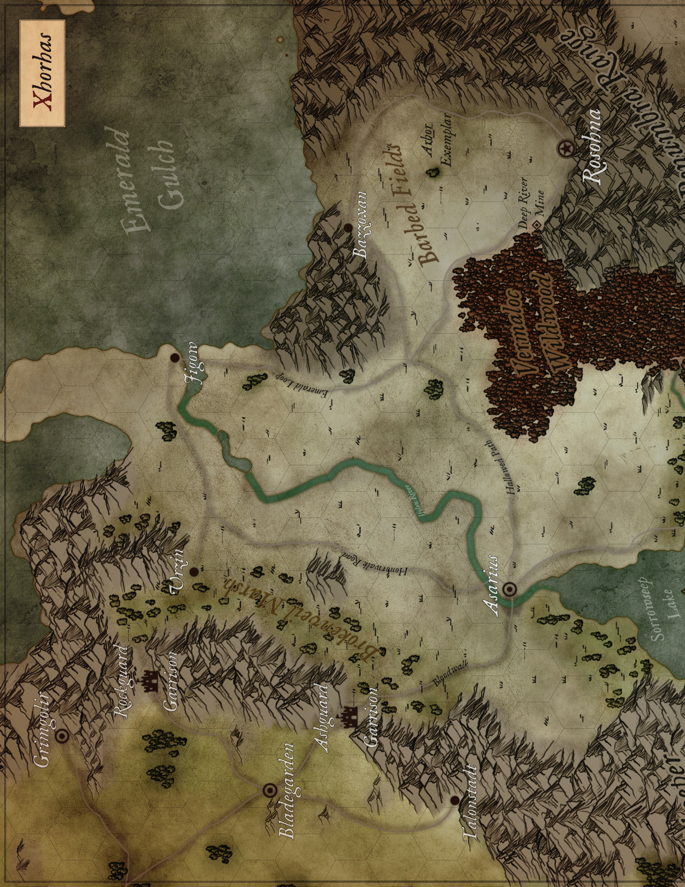{.size-full .print-only}

(print-page)

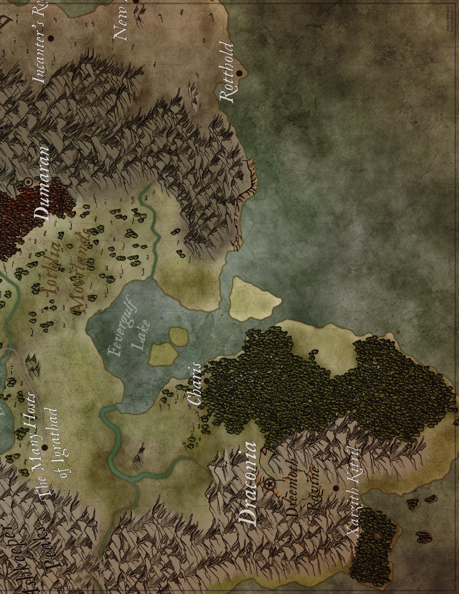{.size-full .print-only}

(print-page)

{.size-cover .screen-only}

## Xhorhas
[^Exandria^](geography) ^>^ [^Wildemount^](wildemount)

^Area:^ **^000,000^ ^sq^ ^mi^** ^-^ ^Population:^ **^00,000^**

Lorem ipsum dolor sit amet, consectetur adipiscing elit. Proin libero diam, tempor sed mauris ac, aliquet dapibus lectus. Donec vulputate sem nunc, eget sagittis est tempor eget. Aliquam eleifend consequat ultricies. Cras euismod porttitor neque, ut condimentum ante placerat nec.

##### Climate
Lorem ipsum dolor sit amet, consectetur adipiscing elit. Proin libero diam, tempor sed mauris ac, aliquet dapibus lectus. Donec vulputate sem nunc, eget sagittis est tempor eget. Aliquam eleifend consequat ultricies. Cras euismod porttitor neque, ut condimentum ante placerat nec.

| |~Spring~|~Summer~|~Fall~|~Winter~|
|:-----|:----:|:----:|:----:|:----:|
| High | 00°  | 00°  | 00°  | 00°  |
| Low  | 00°  | 00°  | 00°  | 00°  |
| Rain | 0.0" | 0.0" | 0.0" | 0.0" |
| Snow | 0.0" | 0.0" | 0.0" | 0.0" | 
{.gray}

*^All^ ^numbers^ ^are^ ^monthly^ ^averages^ ^for^ ^the^ ^season.^*

##### Demographics
Lorem ipsum dolor sit amet, consectetur adipiscing elit. Proin libero diam, tempor sed mauris ac, aliquet dapibus lectus. Donec vulputate sem nunc, eget sagittis est tempor eget. Aliquam eleifend consequat ultricies. Cras euismod porttitor neque, ut condimentum ante placerat nec.

|||||||
|:-----------|:---:|:-----------|:---:|:-----------|:---:|
| -          | -   | -          | -   | -          | -   |
| -          | -   | -          | -   | Other      | -   |
{.gray}

##### Factions
The dominant factions in the region are:
- **Faction**. 
- **Faction**. 
- **Faction**. 
- **Faction**. 
- **Faction**. 
{.square}

##### Geography
The prominent geographical features in the region are:
- Geography
{.square}

##### Settlements
The major settlements in the region are:
- Settlement
{.square}

(print-page)

This page intentionally left blank ... for now.

(print-page)

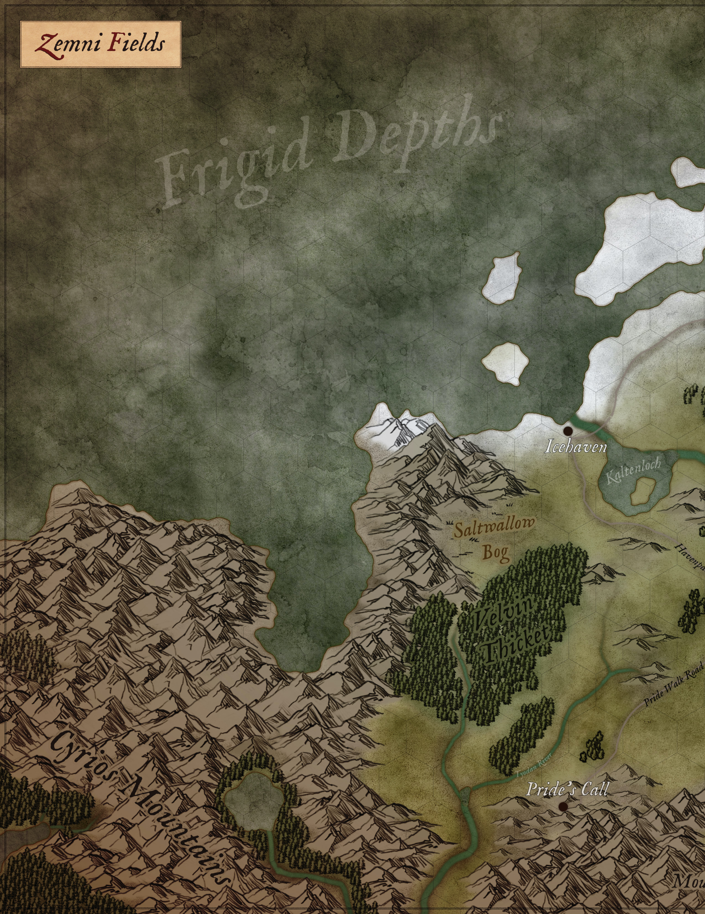{.size-full .print-only}

(print-page)

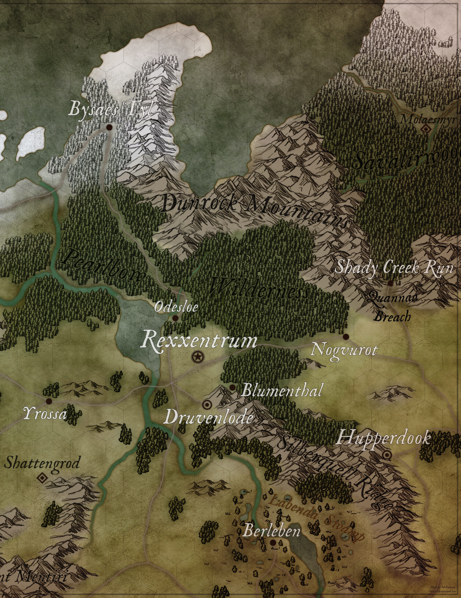{.size-full .print-only}

(print-page)

{.size-cover .screen-only}

## Zemni Fields
[^Exandria^](geography) ^>^ [^Wildemount^](wildemount)

^Area:^ **^000,000^ ^sq^ ^mi^** ^-^ ^Population:^ **^00,000^**

Lorem ipsum dolor sit amet, consectetur adipiscing elit. Proin libero diam, tempor sed mauris ac, aliquet dapibus lectus. Donec vulputate sem nunc, eget sagittis est tempor eget. Aliquam eleifend consequat ultricies. Cras euismod porttitor neque, ut condimentum ante placerat nec.

##### Climate
Lorem ipsum dolor sit amet, consectetur adipiscing elit. Proin libero diam, tempor sed mauris ac, aliquet dapibus lectus. Donec vulputate sem nunc, eget sagittis est tempor eget. Aliquam eleifend consequat ultricies. Cras euismod porttitor neque, ut condimentum ante placerat nec.

| |~Spring~|~Summer~|~Fall~|~Winter~|
|:-----|:----:|:----:|:----:|:----:|
| High | 00°  | 00°  | 00°  | 00°  |
| Low  | 00°  | 00°  | 00°  | 00°  |
| Rain | 0.0" | 0.0" | 0.0" | 0.0" |
| Snow | 0.0" | 0.0" | 0.0" | 0.0" | 
{.gray}

*^All^ ^numbers^ ^are^ ^monthly^ ^averages^ ^for^ ^the^ ^season.^*

##### Demographics
Lorem ipsum dolor sit amet, consectetur adipiscing elit. Proin libero diam, tempor sed mauris ac, aliquet dapibus lectus. Donec vulputate sem nunc, eget sagittis est tempor eget. Aliquam eleifend consequat ultricies. Cras euismod porttitor neque, ut condimentum ante placerat nec.

|||||||
|:-----------|:---:|:-----------|:---:|:-----------|:---:|
| -          | -   | -          | -   | -          | -   |
| -          | -   | -          | -   | Other      | -   |
{.gray}

##### Factions
The dominant factions in the region are:
- **Faction**. 
- **Faction**. 
- **Faction**. 
- **Faction**. 
- **Faction**. 
{.square}

##### Geography
The prominent geographical features in the region are:
- Geography
{.square}

##### Settlements
The major settlements in the region are:
- Settlement
{.square}

(print-page)

This page intentionally left blank ... for now.

(print-page)